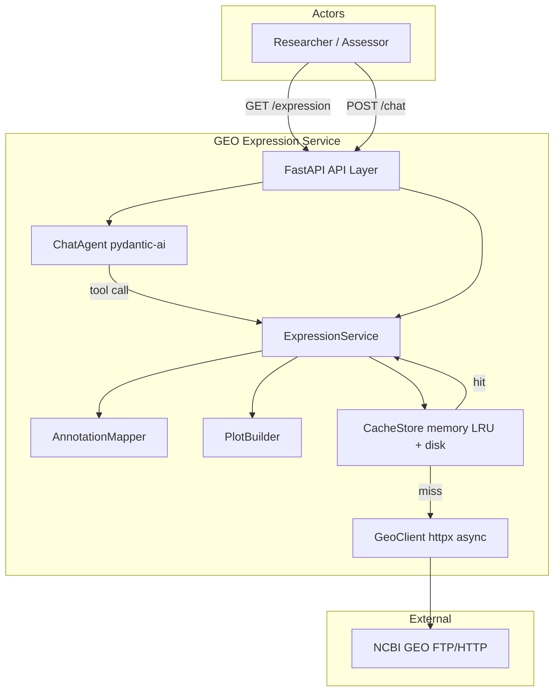
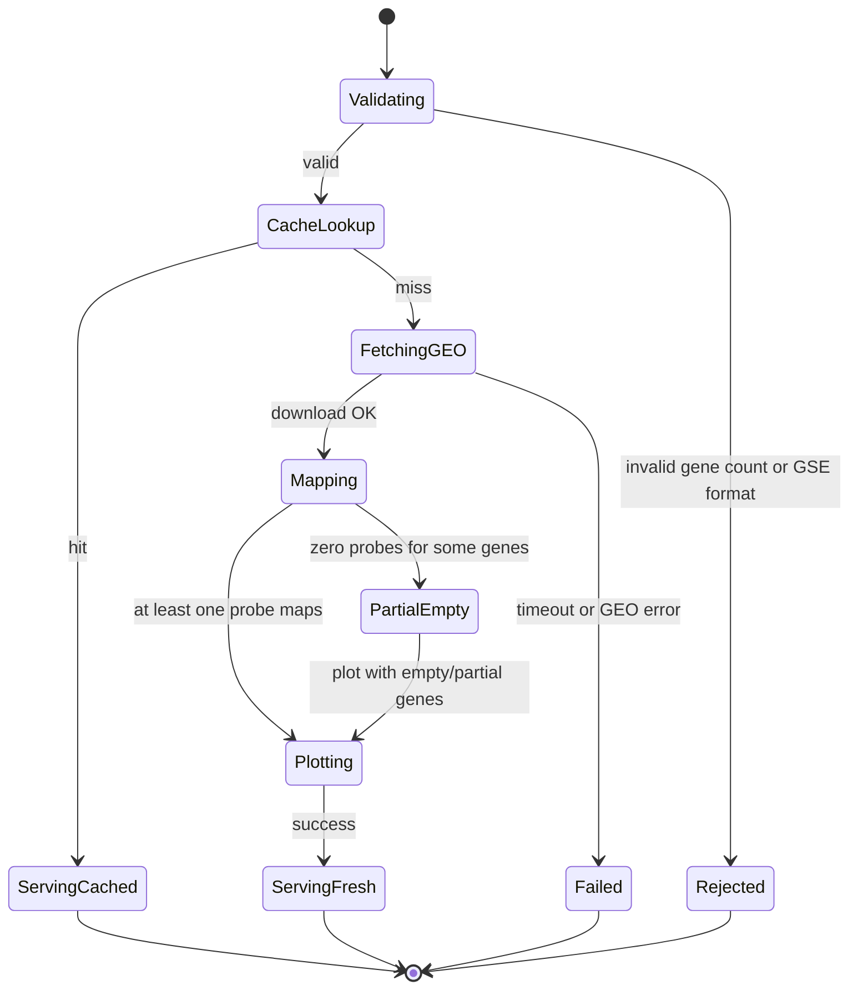
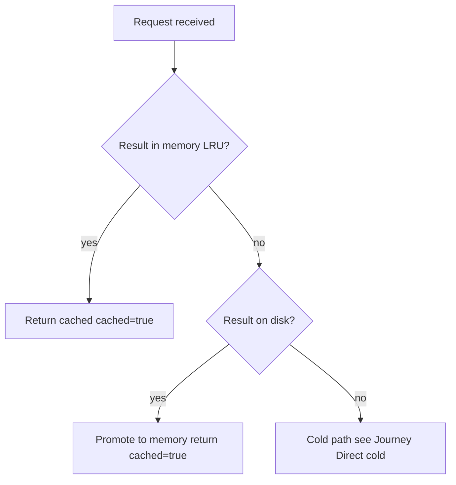
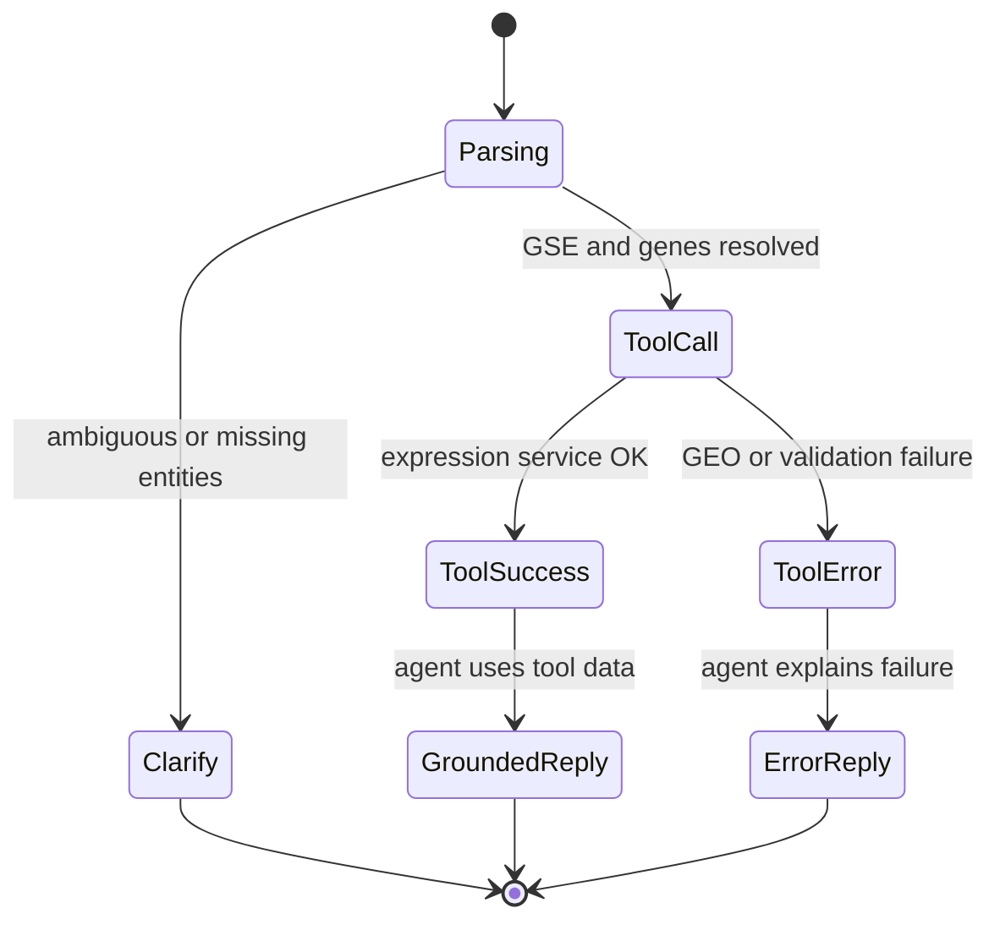

# GEO Expression Service — Solution Draft

## Purpose

This document defines the implementable scope contract, high-level architecture baseline, and behavioral UI/API baseline for the **GEO Expression Service**: a Python 3.11+ service that fetches NCBI GEO expression data, maps probes to gene symbols, returns per-gene boxplots, and exposes that logic both via a direct REST endpoint and a pydantic-ai chat agent with real tool invocation. It bounds what will be built for implementation, review, manual QA, and follow-on detailed specs (API contracts, data models, tech stack choices) without prescribing line-level design.

## References

- `01-Context/01-stakeholders.md`
- `../docs/GEO_EXPRESSION_SERVICE_SPEC.md` — assessment task specification (primary scope source)
- `../task/GEO_EXPRESSION_SERVICE.md` — extended task description (design recommendations, grading criteria)

**Assumption:** `02-Requirements/01-business-requirements.md` and `02-Requirements/02-system-requirements.md` are not yet authored; scope and acceptance items below are derived from stakeholders and the task spec. **Decision (2025-06-14):** defer Steps 6–7; start implementation at F-01; remap to BR/SR when documents exist.

**Assumption:** No `04-UI/` artifacts exist yet; this service is API-first with chat as the primary user channel. A future frontend would consume the same endpoints.

---

## Scope

- **Platforms:** Python 3.11+; FastAPI HTTP API; pydantic-ai agent; async network I/O via `httpx.AsyncClient` only (no blocking `requests`).
- **Endpoints:** At least two — `GET /expression` (direct expression + boxplot) and `POST /chat` (natural-language agent that must invoke an expression tool).
- **Input contract:** GSE series ID + 2–5 gene symbols per request; invalid counts or malformed IDs rejected with clear errors.
- **Gene mapping:** Download GPL platform annotation for the series; map probe IDs → gene symbols; handle multi-gene cells (e.g. `TP53 /// WRAP53`), varying column names (`Gene Symbol`, `GENE_SYMBOL`, `SYMBOL`, …), and missing/null/`---` values; aggregate multiple probes per gene (default: mean of log2 expression values — documented and defensible in README); surface mapping stats (probes mapped per gene, unmapped probe count) — never silently drop all data without reporting.
- **Expression output:** One combined boxplot (all requested genes) returned as PNG (base64 or file path) or structured JSON suitable for client rendering; per-gene sample values available in response metadata where useful for assessor verification.
- **Caching:** Bounded two-tier cache — in-memory LRU in front of persistent on-disk store surviving process restarts; cache at multiple layers (raw downloaded files, parsed probe→symbol maps, final per-gene/boxplot results); include negative caching (failed/unmappable platform fetches not re-downloaded every time); explicit eviction policy (LRU + max entry/size limits); response or logs expose `cached: true/false` and timing so repeat calls show measurable speedup.
- **Chat agent:** pydantic-ai agent with at least one tool calling the same expression service logic as `GET /expression`; user receives plot + short grounded text answer; stub LLM permitted if tool-calling wiring is real (tool invoked, result fed back to agent).
- **Architecture layering:** Clear separation — API routes ↔ expression service (orchestration) ↔ GEO external client ↔ cache adapter ↔ mapping/plot utilities; specific exception types, not bare `except Exception`.
- **Documentation:** README with run instructions plus one paragraph each on gene-mapping and cache trade-offs.
- **Auth / roles:** None — public NCBI GEO data, local/unauthenticated service for assessment.
- **Deployment:** Single-process local or containerized service; no multi-tenant or production SLA in scope.

**Non-goals / deferred:**

- Full web UI or design system (`04-UI/` deferred).
- User accounts, rate limiting beyond local cache bounds, or institutional compliance workflows.
- Support for gene lists >5, arbitrary GEO entity browsing (GSM/GPL-only queries without GSE context), or non-boxplot chart types.
- Guaranteed sub-second first request (GEO downloads may be slow by nature).
- Mandatory SSE streaming for chat (optional enhancement; blocking JSON response acceptable for minimum scope).
- Mandatory test suite (recommended: mapping unit test + cache speedup test — not blocking unless added to formal SR later).

---

## Acceptance checklist (manual)

### Direct expression (`GET /expression`)

- [ ] **Happy path:** Researcher (or assessor via curl/browser) calls `GET /expression?gse=GSE2034&genes=TP53,BRCA1`; response includes usable boxplot (PNG base64 or renderable JSON) within a reasonable first-request timeout; HTTP 200.
- [ ] **Gene count bounds:** Request with 1 gene or 6 genes returns HTTP 4xx with message stating 2–5 genes required.
- [ ] **Invalid GSE:** Non-existent or malformed GSE returns HTTP 4xx/5xx with specific error (not generic 500); no partial plot.
- [ ] **Mapping transparency:** Response includes mapping summary (e.g. probes mapped per gene, count of unmapped probes); if zero probes map for a requested gene, gene appears in response with explicit zero/skip reason — not omitted silently.
- [ ] **Multi-gene annotation:** For a series where annotation contains `GENE /// OTHER`, requested symbol still maps when present in a multi-gene cell.
- [ ] **Cache flag — cold:** First request for a given `(gse, genes)` shows `cached: false` (or log line indicating cache miss) and completes after GEO download latency.
- [ ] **Cache flag — warm:** Identical second request within eviction window shows `cached: true` (or log cache hit) and completes measurably faster (order-of-magnitude reduction vs cold call, verifiable via logs or response timing field).
- [ ] **Cache survives restart:** After service restart, repeat request for same `(gse, genes)` still hits disk cache (warm or warm-ish) without full re-download of raw GEO files.
- [ ] **Bounded cache:** After filling cache beyond configured max entries/size, oldest entries evicted (LRU); service remains stable — no unbounded memory growth over repeated distinct queries.

### Chat agent (`POST /chat`)

- [ ] **Happy path:** POST body e.g. `{"message": "Show me TP53 and BRCA1 expression in GSE2034"}` returns text answer referencing fetched data + plot artifact (embedded base64, URL, or structured plot payload).
- [ ] **Tool invocation (critical):** Server logs or trace show expression tool was invoked with parsed GSE and genes — not a pure LLM completion. A response with plausible biology but no tool call **fails** this check.
- [ ] **Grounded answer:** Text mentions genes/series consistent with tool result; does not invent expression values absent from tool output.
- [ ] **Parse failure:** Message with no recognizable GSE/genes returns helpful clarification prompt (HTTP 200 with agent message or HTTP 4xx — behavior documented in README).
- [ ] **Stub LLM mode:** With API key absent/stub model enabled, tool still runs and plot still returned; only narrative text may be templated.

### Resilience and concurrency (if implemented — verify when present)

- [ ] **Async I/O:** No blocking network calls on event loop (code review / profiler spot-check).
- [ ] **Timeout/retry:** Simulated slow GEO response triggers timeout or retry with backoff; user receives error, not hung request.
- [ ] **Bounded concurrency:** Parallel fetches for multi-gene/multi-file work respect configured semaphore limit (observable in logs under load test).

### Documentation and ops

- [ ] **README run:** Follow README from clean env; service starts and both endpoints respond.
- [ ] **README decisions:** README contains distinct paragraphs explaining mapping aggregation/multi-gene handling and cache layer/eviction trade-offs.
- [ ] **Empty/error edge:** Request for genes not on platform returns structured response (empty plot section or per-gene "no data") with mapping stats — not crash.

---

## Architecture overview

The GEO Expression Service is a **single deployable API process** exposing direct expression queries and a chat facade. All GEO/network access is async. Business logic lives in an **ExpressionService** orchestrator; HTTP routes are thin. A **two-tier CacheStore** (memory LRU → disk) sits between the service and **GeoClient** (NCBI FTP/HTTP downloads). **AnnotationMapper** and **PlotBuilder** are pure-ish domain modules invoked by the service. The **ChatAgent** (pydantic-ai) registers an **ExpressionTool** that delegates to ExpressionService — same code path as `GET /expression`.

### Major components

| Component | Responsibility |
| --- | --- |
| **API Layer** | FastAPI routes, request validation, response serialization (`cached`, timing, plot payload, mapping stats). |
| **ChatAgent** | Parses user intent (or receives structured tool args), invokes ExpressionTool, composes grounded reply. |
| **ExpressionService** | Orchestrates: resolve GSE→GPL+matrix, cache lookup/store, mapping, aggregation, plot generation. |
| **GeoClient** | Async download of series matrix and GPL annotation files; retries/timeouts; returns raw bytes/paths. |
| **AnnotationMapper** | Column detection, probe→symbol parsing, multi-gene split, probe aggregation per gene. |
| **PlotBuilder** | Builds single multi-gene boxplot PNG or JSON structure. |
| **CacheStore** | Keyed layers: `raw:{url}`, `map:{gpl_id}`, `result:{gse}:{genes_hash}`; LRU eviction; negative entries. |

### Trust boundaries and actors

- **Researcher / Technical assessor** — untrusted input (GSE ID, gene symbols, chat text); no authentication.
- **API Layer** — validates input bounds (2–5 genes), sanitizes IDs, maps domain errors to HTTP responses.
- **GeoClient** — trust boundary to public NCBI; read-only; no credentials in scope.
- **Assumption:** Service runs locally or in candidate-controlled environment; no PII stored.

### External systems and integrations

| System | Pattern | Notes |
| --- | --- | --- |
| NCBI GEO | Sync request / async I/O | Download expression matrix + GPL annotation on cache miss; slow, large files. |
| LLM provider (optional) | Sync/async per pydantic-ai | May be stubbed; tool path must remain real. |

### Data at rest and in motion

- **In motion:** HTTP GET/POST JSON; GEO file downloads; optional SSE stream for chat (deferred enhancement).
- **At rest:** Disk cache directory (raw files, parsed maps, serialized results); in-memory LRU index; no database.
- **Primary keys:** GSE ID, GPL ID, normalized gene symbol set hash, download URL.

### Deployment / topology

**Assumption:** Single instance, local or Docker; one cache directory on local filesystem. Horizontal scaling and shared cache **out of scope**.

### Cross-cutting concerns

- **Observability:** Structured logs per request with `request_id`, step timings, cache hit/miss, mapping counts.
- **Configuration:** Cache size limits, concurrency semaphore, GEO timeouts, optional LLM API key via env.
- **Flags:** `cached` on API response; optional `duration_ms` fields for assessor verification.

**Follow-on docs (not in this file):** OpenAPI schema, cache key spec, mapper algorithm detail, chat prompt templates — link back to this overview when authored.

---

## User journeys

### Journey: Direct expression query (cold cache)

**Goal:** User obtains a boxplot of 2–5 genes for a GSE series via REST and sees mapping transparency.

**Primary actor:** Bioinformatics researcher (or assessor via HTTP client).

**Entry:** `GET /expression?gse={GSE}&genes={GENE1,GENE2,...}`  
**Exit:** HTTP 200 with plot + mapping stats + `cached: false`.

**Happy path:**

1. User submits valid GSE and 2–5 gene symbols.
2. API validates input and delegates to ExpressionService.
3. Service checks CacheStore for result key — miss.
4. GeoClient downloads series matrix and GPL annotation (async, with timeout/retry if configured).
5. Raw files stored in cache; AnnotationMapper builds probe→symbol map (cached by GPL).
6. Service aggregates probe expression per gene, PlotBuilder renders boxplot.
7. Result stored in cache; API returns plot, mapping stats, `cached: false`, timing.

**Branches and states:**

**Flow-specific rules:**

- Rejection for gene count outside 2–5 is immediate — no GEO fetch.
- Partial mapping still returns 200 with stats; genes with zero probes listed explicitly.

---

### Journey: Direct expression query (warm cache)

**Goal:** Repeat identical query returns same answer near-instantly with cache hit visible.

**Primary actor:** Bioinformatics researcher.

**Entry:** Same `GET /expression` as cold journey.  
**Exit:** HTTP 200 with `cached: true` and significantly lower latency.

**Happy path:**

1. User repeats exact same GSE + gene set (order-normalized in cache key).
2. ExpressionService finds result in memory LRU or disk tier.
3. API returns cached plot + stats without GeoClient download.

**Branches and states:**

**Flow-specific rules:**

- Second call latency must be measurably lower than first (assessor-verifiable).
- Evicted entries fall back to disk tier before cold GEO fetch.

---

### Journey: Natural-language chat expression

**Goal:** User asks in plain English for gene expression in a series and receives a tool-grounded plot plus short explanation.

**Primary actor:** Bioinformatics researcher.  
**Secondary actor:** ChatAgent / LLM (may be stub).

**Entry:** `POST /chat` with natural-language message.  
**Exit:** JSON (or SSE stream if implemented) with assistant message and plot reference.

**Happy path:**

1. User sends: *"Show me TP53 and BRCA1 expression in GSE2034"*.
2. API forwards to ChatAgent.
3. Agent extracts GSE2034, TP53, BRCA1 and invokes **ExpressionTool**.
4. ExpressionTool calls ExpressionService (same as GET /expression journey).
5. Tool returns plot + mapping stats + numeric summary to agent.
6. Agent composes short text answer grounded in tool output.
7. API returns message + plot artifact to user.

**Branches and states:**

**Flow-specific rules:**

- **Pass/fail for assessment:** ToolCall state must be reached on happy path — answers without tool invocation fail review.
- Stub LLM may template step 6 but steps 3–5 must execute real service logic.

---

### Journey: Unmapped or partial gene mapping

**Goal:** User learns when probes fail to map instead of receiving a misleading plot.

**Primary actor:** Bioinformatics researcher.

**Entry:** Valid `GET /expression` or chat tool call with at least one gene poorly represented on the platform.

**Happy path:**

1. Service completes mapping; some probes or genes have no annotation.
2. Response includes counts: mapped probes per gene, total unmapped probes.
3. Plot includes genes with data; genes without probes appear in stats section with zero mapping.

**Branches:**

- All genes unmapped → 200 with empty plot or per-gene errors + stats (not silent 200 with fake data).
- Negative cache: prior failed GPL parse cached — fast failure with clear message, no repeated download storm.

**Flow-specific rules:**

- Never return success with fabricated expression values.

---

## Traceability

| Scope bullet | Architecture component(s) | Journey(s) |
| --- | --- | --- |
| FastAPI + async httpx | API Layer, GeoClient | Direct cold/warm, Chat |
| GET /expression | API Layer → ExpressionService | Direct cold/warm, Partial mapping |
| POST /chat + tool | ChatAgent → ExpressionTool → ExpressionService | Chat NL |
| Gene mapping / aggregation | AnnotationMapper | Direct cold, Partial mapping, Chat |
| Boxplot output | PlotBuilder | Direct cold/warm, Chat |
| Bounded two-tier cache | CacheStore | Direct warm, Chat (repeat) |
| Mapping transparency | ExpressionService response DTO | Direct cold, Partial mapping |
| README / no auth | N/A (docs, deployment) | N/A |
| SSE streaming (deferred) | ChatAgent | Optional — not in minimum journeys |

| Journey | Acceptance checklist group(s) | Components / stores touched |
| --- | --- | --- |
| Direct expression (cold) | Direct expression — happy, mapping transparency, cache cold | API, ExpressionService, CacheStore miss, GeoClient, NCBI, Mapper, Plotter |
| Direct expression (warm) | Cache warm, cache restart, bounded cache | CacheStore hit, ExpressionService |
| Natural-language chat | Chat agent — all items | API, ChatAgent, ExpressionTool, ExpressionService, CacheStore |
| Partial / unmapped mapping | Direct — mapping transparency, empty/error edge | AnnotationMapper, ExpressionService |

---

## Review checklist

- [ ] Every **Scope** bullet appears in Architecture overview and/or a **User journey**, or is marked deferred with reason.
- [ ] Architecture introduces no components outside Scope (no database, no auth service, no full UI).
- [ ] Chat journey explicitly requires tool invocation — aligns with assessor zero-score rule in spec.
- [ ] Cache cold/warm journeys align with two-tier CacheStore description and measurable speedup acceptance items.
- [ ] Partial mapping and invalid-input branches appear in journey diagrams and acceptance checklist.
- [ ] Gene count bounds (2–5) enforced in validation journey branch, not only in Scope prose.
- [ ] Terminology (GSE, GPL, probe, ExpressionService, CacheStore) consistent across Parts A–C.
- [ ] **References** paths exist or are marked Assumption for missing upstream (BR/SR, 04-UI).
- [ ] No journey depends on deferred features (UI, auth, SSE) for minimum acceptance.
- [ ] Destructive actions N/A — no delete/export flows without confirmation required.

---

## Implementation decisions (2025-06-14)

| Topic | Decision |
| --- | --- |
| Repo layout | Single repo — `pyproject.toml` + package `geo_expression_service/` at repository root |
| Tabular parsing | stdlib `csv` only (no pandas) |
| F-05 resilience | In assessment MVP |
| Build order after cache | F-04 chat before F-05 resilience |
| BR/SR docs | Deferred — start coding; author Steps 6–7 in parallel or post-MVP |

Details: `03-Solution/04-backlog.md` § Implementation decisions.

---

## Open questions

1. **Open:** Primary researcher persona nuance (bench scientist vs core-facility analyst) — affects chat phrasing defaults only; does not change scope.
2. **Assumption:** Default probe aggregation is **mean of log2 expression values**; document alternatives considered in README.
3. **Assumption:** Cache key normalizes gene list order and symbol casing (e.g. uppercase) for repeat-hit correctness.
4. **Open:** Whether SSE streaming for `POST /chat` is in MVP or stretch — minimum scope uses blocking JSON response.
