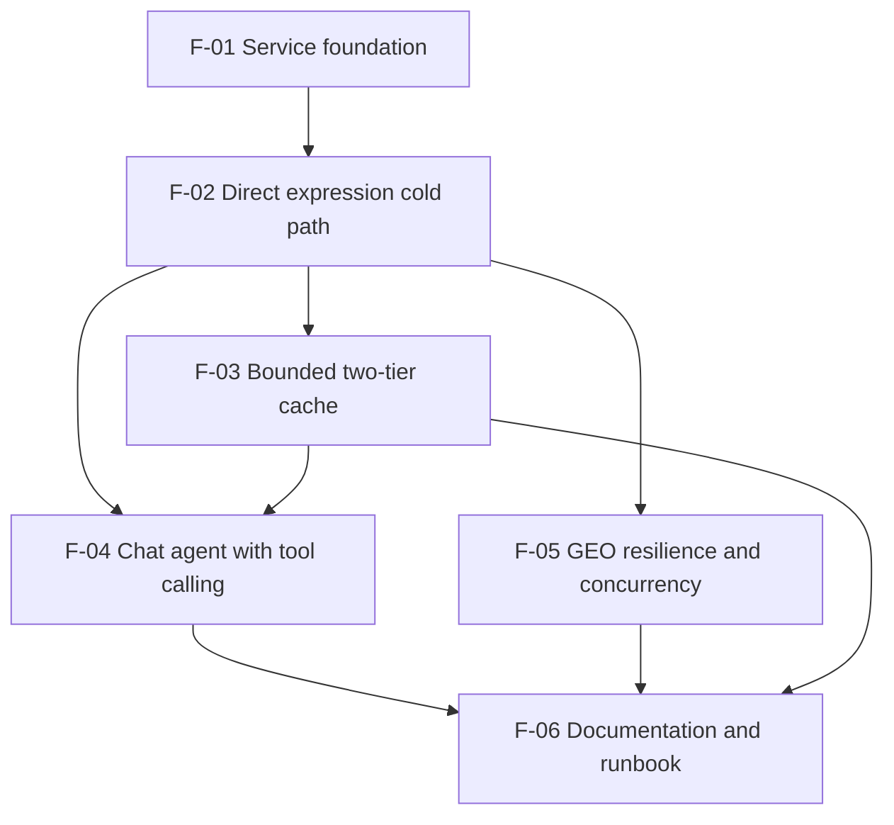

# Feature slices — GEO Expression Service

## Purpose

This document defines a vertical build order for implementing the GEO Expression Service: each slice delivers assessor- or researcher-visible behavior end-to-end (API + orchestration + integration as needed), not horizontal layers. Slices are ordered so the shortest path to a demonstrable expression query is early, with caching and chat layered on the same ExpressionService spine. Scope is subordinate to `03-Solution/01-solution-draft.md`; formal BR/SR traceability is deferred until requirements documents exist.

## References

- Solution draft: `03-Solution/01-solution-draft.md`
- Business requirements: `02-Requirements/01-business-requirements.md` — **not yet authored** (scope taken from solution draft and task spec)
- System requirements: `02-Requirements/02-system-requirements.md` — **not yet authored**
- Scenarios: `01-Context/02-scenarios.md` — **not yet authored** (journeys taken from solution draft § User journeys)
- Glossary: `01-Context/03-glossary.md` — **not yet authored** (terms from stakeholders and solution draft: GSE, GPL, GSM, probe, ExpressionService, CacheStore)
- Stakeholders: `01-Context/01-stakeholders.md`
- Task spec: `../docs/GEO_EXPRESSION_SERVICE_SPEC.md`

---

## 1. Feature list

| ID | Feature | Scope | Provides |
| --- | --- | --- | --- |
| F-01 | Service foundation | Deployable FastAPI process: project layout, config via env, structured logging with `request_id`, domain-specific exception types (no bare `Exception`), health/readiness route, shared request validation for GSE ID format and 2–5 gene symbols. No GEO download, mapping, plot, cache, or chat yet. | App shell, HTTP error mapping contract, config keys (timeouts, cache limits placeholders), logging shape, validation helpers reused by all routes |
| F-02 | Direct expression (cold path) | End-to-end `GET /expression`: GeoClient (async `httpx.AsyncClient`) downloads series matrix + GPL annotation; AnnotationMapper handles column detection, multi-gene cells, missing values, probe→symbol map; ExpressionService orchestrates; PlotBuilder returns one combined multi-gene boxplot (PNG base64 or renderable JSON) plus per-gene mapping stats and sample metadata. Input bounds enforced (2–5 genes); partial/zero mapping surfaced explicitly. **No persistent cache** — every request hits GEO (in-memory pass-through OK). Deferred to F-03: `cached` flag, disk tier, eviction. Deferred to F-04: chat. | `ExpressionService` public API, `GeoClient` interface, `AnnotationMapper` + `PlotBuilder` modules, expression response DTO (plot payload, mapping stats, timing fields), OpenAPI for `GET /expression` |
| F-03 | Bounded two-tier cache | CacheStore: in-memory LRU over persistent disk; layered keys (`raw:{url}`, `map:{gpl_id}`, `result:{gse}:{genes_hash}`); negative caching for failed/unmappable platform fetches; LRU + max size eviction. ExpressionService checks/stores all layers; API exposes `cached: true/false` and measurable `duration_ms`. Repeat identical `(gse, genes)` after restart hits disk without full re-download. Deferred: shared cache across instances (non-goal). | `CacheStore` adapter, cache key normalization (gene order + casing), promotion memory←disk, eviction policy hooks, cache observability fields on expression DTO |
| F-04 | Chat agent with tool calling | `POST /chat` via pydantic-ai ChatAgent with ExpressionTool delegating to the same ExpressionService as F-02/F-03. Natural-language message → parsed GSE + 2–5 genes → real tool invocation → grounded text + plot artifact in JSON response. Stub LLM permitted when API key absent. Clarification path when GSE/genes not resolved. Deferred: SSE streaming (solution non-goal / stretch). | `POST /chat` contract, ExpressionTool registration, agent prompt/tool schema, chat response DTO (message + plot reference), server-side trace/logging proving tool call |
| F-05 | GEO resilience and bounded concurrency | GeoClient retries with backoff, timeouts sized for large files, specific exception propagation to API layer. Bounded semaphore for parallel multi-file/multi-gene fetches. Observable in logs under load. Optional for minimum acceptance but in scope for design discussion. Deferred: resumable/partial downloads (stretch). | Retry/timeout/semaphore config, hardened GeoClient behavior, error types mapped to HTTP 4xx/5xx without hung requests |
| F-06 | Documentation and runbook | README: clean-env run instructions, one paragraph on gene-mapping trade-offs (aggregation, multi-gene cells, unmapped probes), one paragraph on cache layer/eviction trade-offs. Documents both endpoints, stub LLM mode, validation rules, and parse-failure chat behavior. Deferred: formal test suite (recommended, not blocking). | README, `.env.example` if used, assessor verification checklist cross-references |

---

## 2. Dependency order

**Recommended sequence**

1. **F-01** — foundation must land first.
2. **F-02** — first user-visible demo (`GET /expression`, cold path); blocks all downstream slices.
3. **F-03** — cache layer on expression spine.
4. **F-04** — chat agent and tool calling (assessor-critical); requires F-03 for cache metadata passthrough.
5. **F-05** — GeoClient resilience — **in assessment MVP** (decision 2025-06-14); implement after F-04.
6. **F-06** — last; captures final behavior from F-03–F-05.

**Linear backlog order (Phase 7):** F-01 → F-02 → F-03 → F-04 → F-05 → F-06 (`BL-01` … `BL-06`). See `04-backlog.md` § Implementation decisions.

**Parallel note:** F-03 and F-05 are independent in the dependency graph, but **chat-before-resilience** was chosen for assessment prioritization.

---

## 3. Foundation readiness check

| Edge | F-B needs from F-A | Covered? | Gap / fix |
| --- | --- | --- | --- |
| F-01 → F-02 | Validation helpers (2–5 genes, GSE format), exception→HTTP mapping, config for GEO URLs/timeouts, request-scoped logging | Yes | Ensure F-01 exports validation used by expression route before any GeoClient call |
| F-02 → F-03 | Stable ExpressionService entry point, serializable result DTO, GPL ID and download URLs for cache keys, mapper output storable by `map:{gpl_id}` | Yes | F-02 must not embed ad-hoc caching; leave explicit cache adapter seam in ExpressionService |
| F-02 → F-04 | ExpressionService callable with same inputs/outputs as `GET /expression`; plot + mapping stats in tool result | Yes | ExpressionTool must not duplicate mapping/plot logic — single service method |
| F-03 → F-04 | `cached` and timing fields flow through tool result for grounded chat and assessor verification on repeat queries | Partial | Pass cache metadata from ExpressionService through ExpressionTool to chat response; chat happy path works without it but cache acceptance items fail |
| F-02 → F-05 | Isolated GeoClient module with injectable HTTP client and clear failure modes | Yes | GeoClient must live behind interface before wrapping retries/semaphore |
| F-04 → F-06 | Both endpoints stable enough to document; tool-call behavior and stub mode described | Yes | Draft README sections incrementally during F-02/F-04; finalize in F-06 |
| F-05 → F-06 | Documented timeout/retry/concurrency choices | Partial | If F-05 skipped, README states defaults/absence explicitly |
| F-03 → F-06 | Cache layer and eviction trade-offs documented | Yes | Requires F-03 complete before final README cache paragraph |

### Blockers

- **F-03 → F-04 (Partial):** Chat must surface cache hit/miss when F-03 is merged — widen F-04 **Provides** to include cache metadata passthrough before assessor cache checks via chat repeat queries.
- **F-05 → F-06 (Partial):** Only blocks README resilience section if F-05 is in scope for delivery; otherwise document as out-of-scope/default.

No **No** edges — implementation may proceed F-01 → F-02 without waiting on missing BR/SR documents.

### Extension risks

- **Expression logic in routes:** If F-02 puts orchestration in FastAPI handlers instead of ExpressionService, F-03 cache layers and F-04 ExpressionTool will duplicate logic — enforce service boundary in F-02 **Provides**.
- **Mapper without stats contract:** If F-02 omits per-gene probe counts and unmapped totals, F-04 grounded answers and partial-mapping journey cannot be verified — lock mapping summary into response DTO in F-02.
- **Chat before service stable:** F-04 starting before F-02 DTO is frozen risks tool schema churn — freeze expression request/response models at end of F-02.

### Spine path

Shortest chain to **first full assessor demo** (both endpoints, cache verifiable):

**F-01 → F-02 → F-03 → F-04**

- **F-01 → F-02** alone delivers first researcher-visible value (`GET /expression` boxplot, cold).
- **+ F-03** satisfies cache grading (warm path, restart survival, bounded eviction).
- **+ F-04** satisfies tool-calling requirement (`POST /chat`).

F-05 (resilience) and F-06 run after the spine; **F-05 is in assessment MVP** — linear order F-04 → F-05 → F-06 per `04-backlog.md`.

---

## Assumptions

- Business requirements, system requirements, scenarios, and glossary files are absent; slice scope is derived solely from `01-solution-draft.md`, stakeholders, and the task spec — no new BR/SR themes invented. **BR/SR authoring deferred** (2025-06-14); implementation may start at F-01.
- Default probe aggregation is **mean of log2 expression values** (documented in F-06 README).
- Cache keys normalize gene list order and symbol casing (e.g. uppercase).
- Matrix/annotation parsing uses **stdlib `csv` only** (no pandas) — confirmed 2025-06-14.
- **Repo layout:** `pyproject.toml` + package `geo_expression_service/` at repository root — confirmed 2025-06-14.
- F-05 is **in assessment MVP** (retries, semaphore) — implement after F-04 per backlog order.
- No web UI (`04-UI/` deferred per solution non-goals).
- Tests (mapping unit test, cache speedup test) are recommended stretch items, not separate slices.

---

## Open questions

1. **Scenarios and glossary:** Author `01-Context/02-scenarios.md` and `01-Context/03-glossary.md` to align terminology and persona nuance with chat phrasing defaults — optional, non-blocking.
2. **SSE streaming:** Remains stretch; F-04 uses blocking JSON unless scope changes.
