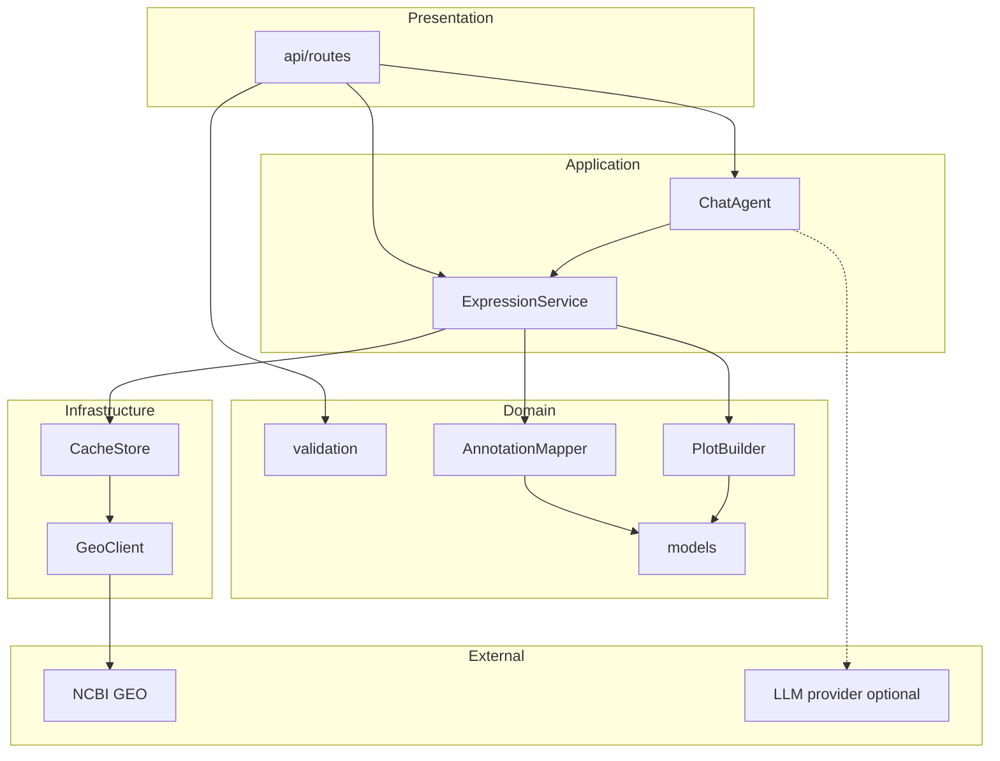
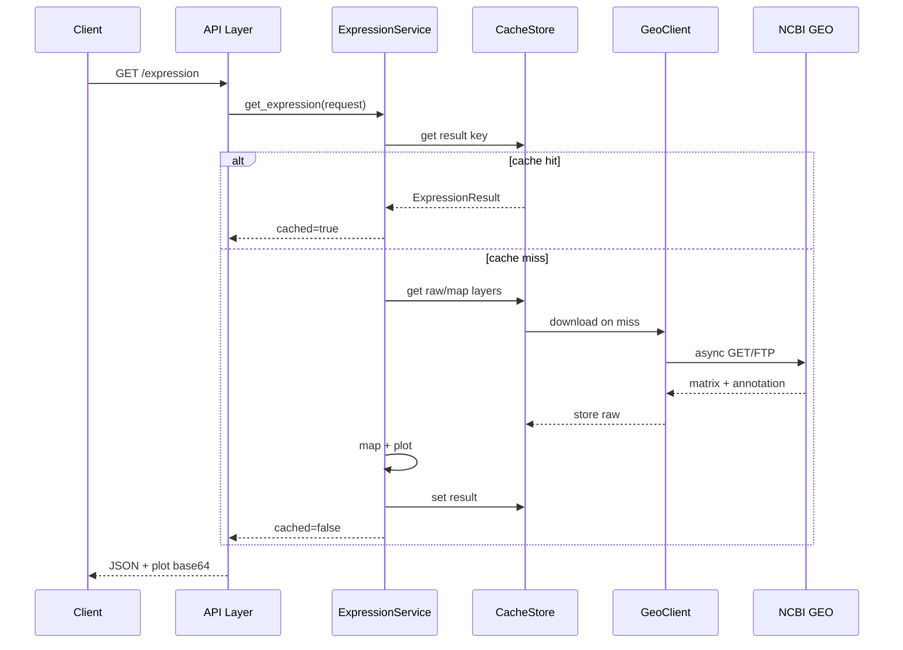

# Architecture — GEO Expression Service

## Purpose

Build-time contract for implementers; expands solution draft Part B (`03-Solution/01-solution-draft.md` § Architecture overview); subordinate to Part A scope and non-goals. This service is **API-first** — no in-scope web UI; HTTP routes and JSON DTOs are the primary surfaces.

## References

- Solution draft: `03-Solution/01-solution-draft.md`
- Feature slices: `03-Solution/02-feature-slices.md`
- Stakeholders: `01-Context/01-stakeholders.md`
- Task spec: `../docs/GEO_EXPRESSION_SERVICE_SPEC.md`
- Extended task notes: `../task/GEO_EXPRESSION_SERVICE.md`
- Project README: `README.md`
- Implementation decisions: `03-Solution/04-backlog.md` § Implementation decisions (2025-06-14)
- **Deferred (non-goal):** `04-UI/` — no vision, mockup plan, design system, or journeys docs; see [Navigation and routing](#navigation-and-routing).

## Relationship to solution draft Part B

| Part B item | Section in this doc |
| --- | --- |
| API Layer (FastAPI routes, validation, serialization) | [Repository and module layout](#repository-and-module-layout), [Navigation and routing](#navigation-and-routing), [Layering and dependencies](#layering-and-dependencies) |
| ChatAgent (pydantic-ai, ExpressionTool) | [Repository and module layout](#repository-and-module-layout), [Integrations and trust boundaries](#integrations-and-trust-boundaries) |
| ExpressionService (orchestration) | [Layering and dependencies](#layering-and-dependencies), [Domain model](#domain-model-implementation), [State management](#state-management) |
| GeoClient (async NCBI downloads) | [Integrations and trust boundaries](#integrations-and-trust-boundaries), [Repository and module layout](#repository-and-module-layout) |
| AnnotationMapper | [Domain model](#domain-model-implementation), [Repository and module layout](#repository-and-module-layout) |
| PlotBuilder | [Domain model](#domain-model-implementation), [Technology stack](#technology-stack) |
| CacheStore (memory LRU + disk, layered keys) | [Persistence and data stores](#persistence-and-data-stores), [State management](#state-management) |
| Data at rest / in motion | [Persistence and data stores](#persistence-and-data-stores), [Domain model](#domain-model-implementation) |
| Deployment (single instance, local/Docker) | [Technology stack](#technology-stack), [Cross-cutting concerns](#cross-cutting-concerns) |
| Cross-cutting (logging, config, `cached` flag) | [Cross-cutting concerns](#cross-cutting-concerns), [Non-functional requirements](#non-functional-requirements) |
| External: NCBI GEO, optional LLM | [Integrations and trust boundaries](#integrations-and-trust-boundaries) |
| User journeys (Part C names only) | Linked in [Navigation and routing](#navigation-and-routing) — not duplicated here |

---

## Technology stack

| Layer | Decision | Notes |
| --- | --- | --- |
| Language / runtime | **Python 3.11+** | Matches task spec and solution scope. |
| HTTP / ASGI | **FastAPI** + **uvicorn** | Thin route layer; OpenAPI auto-generated. |
| Validation / settings | **Pydantic v2** + **pydantic-settings** | Request/response DTOs; env-based config (`GEO_*` prefix). |
| Async HTTP (GEO) | **httpx.AsyncClient** only | No blocking `requests`; injectable client for tests. |
| Chat agent | **pydantic-ai** | One **ExpressionTool** delegating to ExpressionService; stub LLM when API key absent. |
| Plotting | **matplotlib** (+ **numpy** for aggregation) | PNG → base64 in JSON; optional structured plot JSON deferred unless needed for assessor. |
| Tabular parsing | **stdlib `csv`** | **Decision (2025-06-14):** no pandas — minimal deps; manual parsing for messy GEO columns in mapper/geo pipeline. |
| Persistence (cache) | **Filesystem** under configurable directory | No database; in-memory **LRU** (`cachetools` or custom ordered dict) fronting disk files. |
| Serialization on disk | **JSON** (metadata, maps, results) + **raw bytes** (downloaded GEO files) | Human-inspectable cache entries where practical. |
| Auth | **None** | Public NCBI data; local/unauthenticated service. |
| Observability | **stdlib `logging`** | Structured key=value summary lines per user logging rules; `request_id` on every request. |
| Container | **Docker** (optional) | Single-process image; volume mount for cache dir. |
| Test stack (stretch) | **pytest**, **pytest-asyncio**, **httpx** ASGI transport | Mapping unit test + cache speedup test recommended, not blocking MVP. |

---

## Repository and module layout

**Decision (2025-06-14, updated 2025-06-14):** Single git repository — Python package **`geo_expression_service/`** and **`pyproject.toml`** at repository root (sibling to `01-Context/`, `03-Solution/`, `docs/`). Runbook: `docs/run_book.md`. Agent diagrams: `.local/diagrams/`.

```
ncbi-viewer/                    # git repository root
├── pyproject.toml              # dependencies, entry point
├── README.md
├── .local/diagrams/            # Mermaid diagrams (agent)
├── docs/
│   └── run_book.md
├── 01-Context/
├── 03-Solution/
├── geo_expression_service/     # Python package (import path geo_expression_service.*)
│   ├── __init__.py
│   ├── main.py                 # FastAPI app factory, lifespan (httpx client, cache init)
│   ├── config.py               # Settings (pydantic-settings)
│   ├── logging.py              # request_id middleware, log format
│   ├── exceptions.py           # domain exception hierarchy
│   ├── api/
│   │   ├── routes/
│   │   │   ├── health.py       # GET /health
│   │   │   ├── expression.py   # GET /expression
│   │   │   └── chat.py         # POST /chat
│   │   └── dependencies.py     # DI: ExpressionService, ChatAgent
│   ├── services/
│   │   ├── expression_service.py   # orchestration
│   │   └── chat_agent.py           # pydantic-ai agent + ExpressionTool
│   ├── domain/
│   │   ├── models.py           # ExpressionRequest, ExpressionResult, MappingSummary, …
│   │   ├── validation.py       # GSE format, 2–5 genes (F-01)
│   │   ├── annotation_mapper.py
│   │   └── plot_builder.py
│   └── adapters/
│       ├── geo_client.py       # NCBI FTP/HTTP async downloads
│       └── cache_store.py      # two-tier CacheStore
├── .env.example                # optional env template (F-06)
├── Dockerfile                  # optional
└── tests/                      # stretch — mapping, cache speedup
```

**Naming conventions**

- Package and import path: `geo_expression_service.*`
- Module names: snake_case; public service classes: PascalCase (`ExpressionService`, `CacheStore`, `GeoClient`)
- Config env vars: `GEO_CACHE_DIR`, `GEO_CACHE_MAX_ENTRIES`, `GEO_HTTP_TIMEOUT_S`, `GEO_CONCURRENCY_LIMIT`, `OPENAI_API_KEY` (or provider-specific key for pydantic-ai)
- Cache key prefixes (exact): `raw:`, `map:`, `result:` — per solution draft

---

## Layering and dependencies

Allowed dependency direction (inward only):

```
api/routes  →  services  →  domain  ←  adapters (implement ports used by services)
                ↓
            adapters (cache, geo_client)
```

| Layer | Role | May import |
| --- | --- | --- |
| **Presentation** (`api/`) | HTTP mapping, status codes, OpenAPI | `services`, `domain.models`, `domain.validation`, `exceptions` |
| **Application** (`services/`) | ExpressionService orchestration; ChatAgent wiring | `domain/*`, `adapters/*`, `config`, `exceptions` |
| **Domain** (`domain/`) | Pure mapping/plot logic, DTOs, validation rules | stdlib, numpy/matplotlib only in `plot_builder` / mapper |
| **Infrastructure** (`adapters/`) | httpx, filesystem cache, NCBI URLs | `domain.models`, `config`, `exceptions` |

**Rules**

- Routes must not call `GeoClient` or `CacheStore` directly — only `ExpressionService` (and `ChatAgent` for `/chat`).
- `ExpressionTool` in chat agent calls the same `ExpressionService.get_expression(...)` method as `GET /expression`.
- Domain exceptions (`InvalidGeneCountError`, `GeoDownloadError`, `MappingError`, …) map to HTTP in `api/` only — no bare `except Exception`.

---

## Navigation and routing

**N/A — web UI.** Solution draft non-goal: full web UI / `04-UI/` deferred. No screen ids from mockup plan.

**HTTP route table** (maps to solution draft Part C journey names):

| Route id | Method / path | UI surface | Journey (Part C name) | Slice | Guards / notes |
| --- | --- | --- | --- | --- | --- |
| `route.health` | `GET /health` | Liveness JSON | — | F-01 | None |
| `route.expression` | `GET /expression` | Query: `gse`, `genes` (comma-separated) | Direct expression query (cold cache); Direct expression query (warm cache); Unmapped or partial gene mapping | F-02, F-03 | **Guard:** reject if gene count ∉ [2, 5] or GSE format invalid → HTTP 422 before GEO I/O. Partial mapping → HTTP 200 with stats. |
| `route.chat` | `POST /chat` | JSON body: `{ "message": "..." }` | Natural-language chat expression; Unmapped or partial gene mapping (via tool) | F-04 | **Guard:** tool must run when GSE+genes resolved; clarification response when not (HTTP 200 with agent message — behavior documented in README). |

**Back stack / browser nav:** N/A (stateless REST).

**Future frontend:** Would consume `route.expression` and `route.chat` unchanged — no route redesign required.

---

## Domain model (implementation)

### Identifiers and normalization

| Concept | Type / format | Invariants |
| --- | --- | --- |
| **GSE ID** | `str`, pattern `GSE\d+` (case-insensitive input → uppercase) | Must exist for fetch; invalid format rejected at validation (F-01). |
| **Gene symbol** | `str`, non-empty, normalized **uppercase** | 2–5 unique symbols per request after normalization. |
| **GPL ID** | `str`, `GPL\d+` | Resolved from series metadata during cold path. |
| **Probe ID** | `str` | Keys in expression matrix; many probes → one gene. |
| **Cache genes hash** | stable hash of sorted uppercase gene list | Used in `result:{gse}:{genes_hash}`. |

### Core types (`domain/models.py`)

**`ExpressionRequest`**

- `gse_id: str`
- `gene_symbols: list[str]` — length 2–5 after validation

**`GeneMappingStat`**

- `gene_symbol: str`
- `probes_mapped: int`
- `aggregation: Literal["mean_log2"]` — **Assumption:** mean of log2 expression values across mapped probes per sample, then boxplot across samples
- `skip_reason: str | None` — set when `probes_mapped == 0`

**`MappingSummary`**

- `per_gene: list[GeneMappingStat]`
- `unmapped_probe_count: int`
- `gpl_id: str`

**`PlotArtifact`**

- `format: Literal["png_base64"]` (minimum); optional `json_figure` stretch
- `content: str` — base64 PNG for combined multi-gene boxplot (one plot, all genes)

**`ExpressionResult`**

- `gse_id: str`
- `genes: list[str]`
- `plot: PlotArtifact`
- `mapping: MappingSummary`
- `sample_values_by_gene: dict[str, list[float]] | None` — optional metadata for assessor verification
- `cached: bool` — F-03; default `false` in F-02
- `duration_ms: float`

**`ChatRequest`** — `message: str`

**`ChatResponse`**

- `message: str` — grounded assistant text
- `expression: ExpressionResult | None` — present when tool succeeded
- `tool_invoked: bool` — must be `true` on happy path (logging + response field for assessor)

### AnnotationMapper behavior (invariants)

- Detect symbol column among known headers (`Gene Symbol`, `GENE_SYMBOL`, `SYMBOL`, …).
- Split multi-gene cells on `///` (and trim); match requested symbol if present in cell.
- Treat missing, null, empty, `---` as unmapped.
- Aggregate multiple probes per gene: **mean of log2 values** per sample before boxplot statistics.
- Never fabricate expression when zero probes map — surface in `GeneMappingStat.skip_reason`.

### Lifecycle states (expression pipeline)

Aligns with solution draft journey state diagrams — implementation states inside `ExpressionService`:

`Validating` → `CacheLookup` → (`ServingCached` | `FetchingGEO` → `Mapping` → `Plotting` → `ServingFresh`) | `Rejected` | `Failed`

---

## State management

| State | Owner | Scope | Survival |
| --- | --- | --- | --- |
| **Request context** (`request_id`, start time) | FastAPI middleware / `logging` | Per HTTP request | Dies with request |
| **In-flight downloads** | `GeoClient` (httpx + semaphore) | Per request / shared client | Process lifetime |
| **Memory LRU index** | `CacheStore` | Process-global | Lost on restart; rebuilt from disk tier on access |
| **Disk cache entries** | `CacheStore` | Configured directory | Survives restart (F-03 acceptance) |
| **Chat agent session** | Stateless per request | Single `POST /chat` | **Assumption:** no multi-turn session store in MVP — each message standalone unless pydantic-ai thread id added later |
| **Application config** | `Settings` | Loaded at startup | Env change requires restart |

No user session, auth tokens, or server-side chat history in scope.

---

## Persistence and data stores

**Technology:** Local filesystem only — no SQL/NoSQL.

**Cache directory:** `GEO_CACHE_DIR` (default: `./.cache/geo_expression/` relative to process CWD).

### Cache layers and keys

| Layer | Key pattern | Value | TTL / eviction |
| --- | --- | --- | --- |
| Raw download | `raw:{url_hash}` | Raw file bytes + sidecar metadata (url, fetched_at) | LRU + max total bytes/entry count |
| Parsed map | `map:{gpl_id}` | Serialized probe→symbol map + column metadata | Same store; negative entry if parse failed |
| Expression result | `result:{gse_id}:{genes_hash}` | Serialized `ExpressionResult` (or plot + mapping subset) | Same store |

**Negative caching:** Failed/unmappable GPL fetch or parse stored with sentinel; subsequent requests fail fast with clear error — no download storm.

**Eviction:** In-memory LRU tracks hot keys; on eviction, disk tier retains entry until disk limits exceeded. Disk eviction: LRU by last access or entry timestamp — **Assumption:** single LRU policy applied to result keys; raw files evicted by total size cap (`GEO_CACHE_MAX_BYTES`).

**Read/write boundaries**

- Only `CacheStore` adapter reads/writes cache files.
- `ExpressionService` calls `cache.get` / `cache.set` — never constructs filesystem paths directly.
- `GeoClient` writes through `CacheStore` on miss (or returns bytes to service which stores — pick one path in F-02 and keep consistent).

**Migration / versioning:** Cache entry JSON includes `schema_version: 1`; bump invalidates or ignores incompatible entries (simple delete-on-read mismatch).

---

## Content, assets, or static catalog

**N/A.** No bundled annotation catalogs or locale files — all GPL/matrix data fetched from NCBI at runtime. Static content limited to optional `.env.example` and README.

---

## Integrations and trust boundaries

| External system | Direction | Pattern | Auth | Trust boundary |
| --- | --- | --- | --- | --- |
| **NCBI GEO** (FTP/HTTP) | Outbound read | Async download via `GeoClient`; timeout + retry (F-05) | None (public) | Untrusted size/latency; validate paths; no credential storage |
| **LLM provider** (OpenAI-compatible or pydantic-ai default) | Outbound | Sync/async per pydantic-ai model config | API key via env | Optional — stub model permitted; **tool path must remain real** |
| **Client (researcher/assessor)** | Inbound | REST JSON | None | Untrusted input — validate GSE/genes/chat text length |

**Sync/async:** GEO I/O is async await; LLM call may block thread pool — acceptable for MVP blocking JSON chat response.

**No other integrations** (no auth provider, no message queue, no object storage).

---

## Non-functional requirements

Formal **SR-…** documents absent — themes from solution draft acceptance checklist:

| Theme | Target | Verification |
| --- | --- | --- |
| **Performance (repeat query)** | Second identical `(gse, genes)` measurably faster; `cached: true` | Logs / `duration_ms`; assessor cold vs warm |
| **Performance (first query)** | No sub-second guarantee | Document GEO latency in README |
| **Offline / restart** | Disk cache survives process restart | Restart test in acceptance checklist |
| **Bounded resources** | LRU + max entries/size; semaphore on parallel fetches (F-05) | Load / repeated distinct queries |
| **Security** | No auth; no PII; read-only public GEO | No secrets in repo; `.env` gitignored |
| **Privacy** | No user data stored beyond cache keys derived from queries | Cache dir local to deployer |
| **Accessibility** | N/A API-only | — |
| **Reliability** | Specific exceptions; timeouts; no hung requests (F-05) | Simulated slow GEO |
| **Observability** | `request_id`, step summaries, cache hit/miss, mapping counts | Log grep |

When `02-Requirements/02-system-requirements.md` is authored (Step 7), remap rows to **SR-…** IDs without changing behavior.

---

## Cross-cutting concerns

| Concern | Implementation |
| --- | --- |
| **Logging** | Middleware assigns `request_id`; services log step finish lines: `"Expression finished: cached=%s duration_ms=%s request_id=%s"` |
| **Errors** | Hierarchy in `exceptions.py`; API maps to 422 (validation), 404/502 (GEO not found / upstream), 504 (timeout) |
| **Configuration** | `Settings` from env; sensible defaults documented in `.env.example` |
| **Feature flags** | `GEO_STUB_LLM=true` or absent API key → stub narrative; tool still executes |
| **OpenAPI** | FastAPI `/docs` for assessor manual QA |
| **Extensibility** | `GeoClient` and `CacheStore` as classes behind protocols for test doubles |

---

## Feature-slice mapping

| Slice | Modules / routes / types introduced or extended |
| --- | --- |
| **F-01** | `main.py`, `config.py`, `logging.py`, `exceptions.py`, `domain/validation.py`, `api/routes/health.py`, `GET /health` |
| **F-02** | `api/routes/expression.py`, `services/expression_service.py`, `adapters/geo_client.py`, `domain/annotation_mapper.py`, `domain/plot_builder.py`, `domain/models.py` (`ExpressionRequest`, `ExpressionResult`, `MappingSummary`, `PlotArtifact`), `GET /expression` |
| **F-03** | `adapters/cache_store.py`, cache fields on `ExpressionResult` (`cached`, `duration_ms`), ExpressionService cache seam, env keys for cache limits |
| **F-04** | `services/chat_agent.py`, `api/routes/chat.py`, `ChatRequest`/`ChatResponse`, ExpressionTool → ExpressionService, `POST /chat` |
| **F-05** | `adapters/geo_client.py` retries/backoff/semaphore, extended `config.py`, error mapping for timeout/upstream failures |
| **F-06** | Root `README.md`, `.env.example`, cross-links to acceptance checklist; no new runtime modules |

---

## Diagrams

### Module and layer structure



### Request / cache data flow



---

## Review checklist

- [ ] Every Part B component maps to a module or explicit N/A above.
- [ ] Stack decisions recorded — no silent TBD in persistence or runtime sections.
- [ ] All six feature slices (F-01–F-06) appear in feature-slice mapping.
- [ ] HTTP routes cover direct expression, chat, and health; gene count guard documented.
- [ ] Cache key scheme matches solution draft (`raw:`, `map:`, `result:`).
- [ ] ExpressionTool shares ExpressionService code path with `GET /expression`.
- [ ] No database, auth service, or web UI modules introduced.
- [ ] References list only real paths or mark not-yet-authored explicitly.
- [ ] Consistent terminology: GSE, GPL, probe, ExpressionService, CacheStore.

---

## Assumptions

1. Python package is `geo_expression_service/` at repository root; `pyproject.toml` at repo root — **confirmed 2025-06-14**.
2. Default probe aggregation is **mean of log2 expression values** across mapped probes per sample.
3. Cache keys normalize gene list order (sorted) and symbol casing (uppercase).
4. Matrix and annotation parsing use **stdlib `csv` only** (no pandas) — **confirmed 2025-06-14**; document trade-offs in F-06 README.
5. Chat MVP is **stateless** (single-turn per `POST /chat`).
6. Disk cache JSON uses `schema_version: 1` for forward compatibility.
7. Blocking JSON chat response (no SSE) for minimum scope.
8. F-05 GeoClient resilience (retries, semaphore) is **in assessment MVP** — implement after F-04 chat per backlog order **BL-05 → BL-04**.
9. Formal BR/SR documents **deferred** — start implementation without Steps 6–7; remap NFR to **SR-…** when authored.

---

## Open questions

1. **SSE streaming:** Remains stretch for `POST /chat` unless scope changes.
2. **04-UI deferral:** When/if chat web UI is added, run Steps 10–15 and extend this doc with screen-id route map — no mockup-plan screen ids exist today.
3. **Scenarios / glossary:** Optional context docs for chat phrasing — non-blocking.
