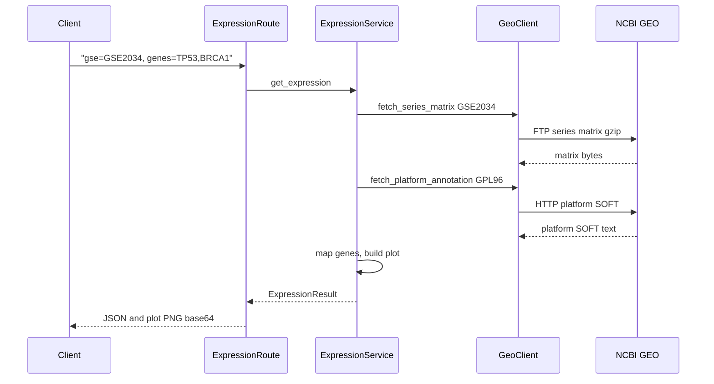

# Run book — GEO Expression Service

Пошаговая инструкция: установка, запуск и запросы к NCBI GEO.

> Ссылки работают в **Markdown Preview** (`Ctrl+Shift+V`).

## Оглавление

- [Быстрый старт](#quick-start)
- [Установка (подробно)](#setup)
  - [Пересоздание .venv](#venv-recreate)
- [Makefile](#makefile)
- [Проверка health](#health)
- [GET /expression](#expression)
  - [Что происходит при запросе](#ncbi-flow)
  - [Параметры и примеры](#expression-params)
  - [Логи и ответ](#expression-response)
  - [Сохранить график](#save-plot)
- [POST /chat](#chat)
  - [Режимы stub / LLM](#chat-modes)
  - [Примеры и ответ](#chat-examples)
  - [Clarification](#chat-clarification)
- [Swagger UI](#swagger)
- [Примеры ошибок](#errors)
- [Переменные окружения](#env)
- [Тесты](#tests)
- [Типичные проблемы](#troubleshooting)
- [Чеклист](#checklist)
- [Полезные ссылки](#links)

---

<a id="quick-start"></a>

## Быстрый старт

Все команды — из **корня git-репозитория** (`ncbi-viewer/`, рядом с `pyproject.toml`).

**WSL / bash / macOS / Linux:**

```bash
cd ncbi-viewer
python3 --version          # нужен 3.11+
python3 -m venv .venv
source .venv/bin/activate
pip install -e .
python -m uvicorn geo_expression_service.main:app --host 127.0.0.1 --port 8000
```

**PowerShell (Windows):**

```powershell
cd ncbi-viewer
python -m venv .venv
.\.venv\Scripts\Activate.ps1
pip install -e .
python -m uvicorn geo_expression_service.main:app --host 127.0.0.1 --port 8000
```

Или: `make install && make run` (нужен GNU Make).

В **другом** терминале:

```bash
curl -s http://127.0.0.1:8000/health
curl -s --max-time 300 "http://127.0.0.1:8000/expression?gse=GSE2034&genes=TP53,BRCA1"
curl -s --max-time 300 -X POST http://127.0.0.1:8000/chat \
  -H "Content-Type: application/json" \
  -d '{"message": "Show me TP53 and BRCA1 expression in GSE2034"}'
```

Первый запрос `/expression` или `/chat` с новой парой `(gse, genes)` скачивает ~60 MB с NCBI — **30–120 секунд** это нормально. Повторный запрос должен вернуть `"cached": true` и меньший `duration_ms`.

> Используйте `python -m uvicorn`, если команда `uvicorn` не найдена.

Подробный setup, troubleshooting и design decisions: [README.md](../README.md).

| Метод | Путь | NCBI |
|-------|------|------|
| `GET` | `/health` | нет |
| `GET` | `/expression` | да — matrix + platform annotation |
| `POST` | `/chat` | да, если распознаны GSE и 2–5 генов |

---

<a id="setup"></a>

## Установка (подробно)

### Требования

- **Python 3.11+** (`python3 --version` в WSL/Linux, `python --version` в Windows)
- **Интернет** — `/expression` и `/chat` обращаются к `ftp.ncbi.nlm.nih.gov` и `www.ncbi.nlm.nih.gov`
- **Windows / WSL / macOS / Linux**

### Клонирование

```bash
git clone <repo-url> ncbi-viewer
cd ncbi-viewer
```

### Виртуальное окружение

> **Важно:** создавайте `.venv` только в **корне репозитория** (`ncbi-viewer/`), а **не** в `geo_expression_service/`.

**WSL / bash:**

```bash
python3 -m venv .venv
source .venv/bin/activate
```

**PowerShell:**

```powershell
python -m venv .venv
.\.venv\Scripts\Activate.ps1
```

После активации в prompt появится `(.venv)`.

### Установка зависимостей

```bash
pip install -e .
```

С dev-зависимостями (pytest, ruff):

```bash
pip install -e ".[dev]"
# или: make install-dev
```

Проверка:

```bash
python -c "import geo_expression_service; print('OK')"
python -m uvicorn --version
```

### Запуск сервера

```bash
python -m uvicorn geo_expression_service.main:app --host 127.0.0.1 --port 8000
```

С автоперезагрузкой: добавьте `--reload`.

Успешный старт:

```
INFO:     Uvicorn running on http://127.0.0.1:8000 (Press CTRL+C to quit)
INFO:     Application startup complete.
```

Остановка: `Ctrl+C`. Если порт занят — см. [типичные проблемы](#troubleshooting).

<a id="venv-recreate"></a>

### Пересоздание .venv

Если окружение сломано или создано не в том каталоге:

**WSL / bash:**

```bash
cd ncbi-viewer
deactivate 2>/dev/null || true
rm -rf .venv
python3 -m venv .venv
source .venv/bin/activate
pip install -e .
```

**PowerShell:**

```powershell
cd ncbi-viewer
deactivate
Remove-Item -Recurse -Force .venv -ErrorAction SilentlyContinue
python -m venv .venv
.\.venv\Scripts\Activate.ps1
pip install -e .
```

---

<a id="makefile"></a>

## Makefile

Из корня репозитория. Полный список: `make help` или [README § Implementation](../README.md#implementation).

```bash
make install       # .venv + pip install -e .
make run           # uvicorn на :8000
make run-dev       # uvicorn с --reload
make test          # pytest -v (нужен install-dev)
make check         # lint + test
make health        # curl /health (сервер уже запущен)
make plot          # сохранить expression_plot.png
```

Параметры: `make run PORT=8001`, `make plot GSE=GSE2034 GENES=TP53,BRCA1`.

---

<a id="health"></a>

## Проверка health

Убедитесь, что сервер жив **до** долгого запроса к GEO.

**Браузер:** [http://127.0.0.1:8000/health](http://127.0.0.1:8000/health)

```bash
curl -s http://127.0.0.1:8000/health
```

```powershell
Invoke-RestMethod -Uri "http://127.0.0.1:8000/health" | ConvertTo-Json
```

Ожидаемый ответ: `{"status":"ok","service":"geo-expression-service"}`.

---

<a id="expression"></a>

## GET /expression

<a id="ncbi-flow"></a>

### Что происходит при запросе



`GeoClient` (`geo_expression_service/adapters/geo_client.py`) выполняет два запроса к NCBI: series matrix (FTP) и platform annotation (HTTP acc.cgi).

<a id="expression-params"></a>

### Параметры и примеры

| Параметр | Обязательный | Формат | Пример |
|----------|--------------|--------|--------|
| `gse` | да | `GSE` + цифры | `GSE2034` |
| `genes` | да | 2–5 уникальных символов через запятую | `TP53,BRCA1` |

GSE и гены приводятся к верхнему регистру. Меньше 2 или больше 5 генов → HTTP **422**.

```bash
curl -s --max-time 300 \
  "http://127.0.0.1:8000/expression?gse=GSE2034&genes=TP53,BRCA1"
```

С `jq` (ключевые поля):

```bash
curl -s --max-time 300 \
  "http://127.0.0.1:8000/expression?gse=GSE2034&genes=TP53,BRCA1" \
  | jq '{gse_id, genes, cached, duration_ms, gpl: .mapping.gpl_id}'
```

```powershell
$uri = "http://127.0.0.1:8000/expression?gse=GSE2034&genes=TP53,BRCA1"
$result = Invoke-RestMethod -Uri $uri -TimeoutSec 300
$result | Select-Object gse_id, genes, cached, duration_ms
```

<a id="expression-response"></a>

### Логи и ответ

При успешном cold-path в терминале с uvicorn:

```
INFO geo_expression_service.adapters.geo_client GEO download finished: resource=series matrix GSE2034 bytes=...
INFO geo_expression_service.adapters.geo_client Series matrix parsed: gse_id=GSE2034 gpl_id=GPL96 probes=... samples=...
INFO geo_expression_service.adapters.geo_client GEO download finished: resource=platform GPL96 bytes=...
INFO geo_expression_service.domain.annotation_mapper Gene mapping finished: genes=2 mapped_probes=... ...
INFO geo_expression_service.services.expression_service Expression finished: cached=false duration_ms=... gse_id=GSE2034 genes=2
```

Пример ответа (сокращённо):

```json
{
  "gse_id": "GSE2034",
  "genes": ["TP53", "BRCA1"],
  "plot": { "format": "png_base64", "content": "iVBORw0KGgoAAAANSUhEUgAA..." },
  "mapping": {
    "gpl_id": "GPL96",
    "unmapped_probe_count": 1234,
    "per_gene": [
      { "gene_symbol": "TP53", "probes_mapped": 2, "aggregation": "mean_log2", "skip_reason": null }
    ]
  },
  "cached": false,
  "duration_ms": 45230.5
}
```

| Поле | Смысл |
|------|-------|
| `plot.content` | PNG в base64 |
| `cached` | `false` на cold path; `true` при повторном запросе с тем же `(gse, genes)` |
| `duration_ms` | Время запроса, включая загрузку с NCBI |

<a id="save-plot"></a>

### Сохранить график

Поле `plot.content` (в `/expression`) или `expression.plot.content` (в `/chat`) — PNG **без** префикса `data:image/png;base64,`.

Онлайн: [Base64 Guru — Decode image](https://base64.guru/converter/decode/image)

```powershell
$response = Invoke-RestMethod -Uri "http://127.0.0.1:8000/expression?gse=GSE2034&genes=TP53,BRCA1" -TimeoutSec 300
[IO.File]::WriteAllBytes("expression_plot.png", [Convert]::FromBase64String($response.plot.content))
```

```python
import base64, json, urllib.request

url = "http://127.0.0.1:8000/expression?gse=GSE2034&genes=TP53,BRCA1"
with urllib.request.urlopen(url, timeout=300) as resp:
    data = json.load(resp)
with open("expression_plot.png", "wb") as f:
    f.write(base64.b64decode(data["plot"]["content"]))
```

Для `/chat` используйте `response.expression.plot.content` вместо `response.plot.content`.

---

<a id="chat"></a>

## POST /chat

Естественный язык → тот же `ExpressionService`, что и `GET /expression`. Ответ: текст ассистента + вложенный `expression` с plot и mapping stats.

<a id="chat-modes"></a>

### Режимы stub / LLM

| Режим | Когда | LLM | Tool (GEO) |
|-------|--------|-----|------------|
| **Stub** (по умолчанию) | нет `OPENAI_API_KEY` или `GEO_STUB_LLM=true` | шаблонный текст | **да** — реальный `ExpressionService` |
| **LLM** | задан `OPENAI_API_KEY`, `GEO_STUB_LLM` не true | OpenAI (`GEO_OPENAI_MODEL`) | **да** — tool `get_gene_expression` |

Stub достаточен для оценки: tool вызывается, plot возвращается, в логах есть `ExpressionTool invoked`.

<a id="chat-examples"></a>

### Примеры и ответ

В сообщении: accession `GSE` + цифры и **2–5** символов генов.

```bash
curl -s --max-time 300 -X POST http://127.0.0.1:8000/chat \
  -H "Content-Type: application/json" \
  -d '{"message": "Show me TP53 and BRCA1 expression in GSE2034"}'
```

Повторный запрос — проверка кэша (`expression.cached` должен стать `true`):

```bash
curl -s --max-time 300 -X POST http://127.0.0.1:8000/chat \
  -H "Content-Type: application/json" \
  -d '{"message": "TP53 and BRCA1 in GSE2034"}'
```

```powershell
$body = '{"message": "Show me TP53 and BRCA1 expression in GSE2034"}'
Invoke-RestMethod -Uri "http://127.0.0.1:8000/chat" -Method POST `
  -ContentType "application/json" -Body $body -TimeoutSec 300 |
  Select-Object tool_invoked, message, @{n='cached';e={$_.expression.cached}}
```

Пример ответа (сокращённо):

```json
{
  "message": "Here is expression for TP53, BRCA1 in GSE2034 (platform GPL96)...",
  "expression": { "gse_id": "GSE2034", "genes": ["TP53", "BRCA1"], "cached": false, "plot": { "format": "png_base64", "content": "..." } },
  "tool_invoked": true
}
```

| Поле | Смысл |
|------|-------|
| `tool_invoked` | `true` — ExpressionTool реально вызван |
| `expression` | Тот же DTO, что у `GET /expression`; `null`, если tool не вызывался |

Логи happy path:

```
INFO geo_expression_service.services.chat_agent ExpressionTool invoked: gse_id=GSE2034 genes=['TP53', 'BRCA1'] request_id=...
INFO geo_expression_service.services.expression_service Expression finished: cached=false duration_ms=... gse_id=GSE2034 genes=2
```

<a id="chat-clarification"></a>

### Clarification (без tool)

Если GSE или гены не распознаны — HTTP **200**, `tool_invoked: false`, `expression: null`, текст с подсказкой.

```bash
curl -s -X POST http://127.0.0.1:8000/chat \
  -H "Content-Type: application/json" \
  -d '{"message": "Hello, what can you do?"}'
```

```bash
curl -s -X POST http://127.0.0.1:8000/chat \
  -H "Content-Type: application/json" \
  -d '{"message": "Show TP53 in GSE2034"}'
```

Второй пример — только один ген (нужно 2–5).

---

<a id="swagger"></a>

## Swagger UI

| URL | Описание |
|-----|----------|
| [http://127.0.0.1:8000/docs](http://127.0.0.1:8000/docs) | Swagger UI |
| [http://127.0.0.1:8000/redoc](http://127.0.0.1:8000/redoc) | ReDoc |

1. `GET /health` → **Try it out** → **Execute** (быстро).
2. `GET /expression` → `gse=GSE2034`, `genes=TP53,BRCA1` → **Execute** (до 2 мин; в логах — `GEO download finished`).
3. `POST /chat` → body `{"message": "Show me TP53 and BRCA1 expression in GSE2034"}` → проверьте `tool_invoked: true`.

---

<a id="errors"></a>

## Примеры ошибок

| Ситуация | HTTP | `error` / поведение |
|----------|------|---------------------|
| Неверный GSE | 422 | `invalid_gse_format` |
| 1 или 6+ генов | 422 | `invalid_gene_count` |
| NCBI недоступен / таймаут | 502 | `geo_download_error` |
| Ошибка разбора аннотации | 502 | `mapping_error` |
| Чат: нераспознанное сообщение | 200 | `tool_invoked: false`, clarification |
| Чат: невалидные гены в tool | 422 | как у `/expression` |

---

<a id="env"></a>

## Переменные окружения

Полный список: [`.env.example`](../.env.example) (файл `.env` — в корне репозитория).

| Переменная | По умолчанию | Когда менять |
|------------|--------------|--------------|
| `GEO_HTTP_TIMEOUT_S` | `120` | Медленная сеть, частые `502 geo_download_error` |
| `GEO_STUB_LLM` | `false` | `true` — stub-чат без OpenAI |
| `OPENAI_API_KEY` | — | LLM-режим чата |
| `GEO_CACHE_DIR` | `.cache/geo_expression` | Другой каталог для disk cache |

Пример для медленной сети:

```env
GEO_HTTP_TIMEOUT_S=180
GEO_STUB_LLM=true
```

---

<a id="tests"></a>

## Тесты

```bash
make test
# или: pip install -e ".[dev]" && pytest -v
```

Тесты не обращаются к live NCBI (mocks). Покрывают mapping, cache, validation, chat stub path, GeoClient retry/timeout.

---

<a id="troubleshooting"></a>

## Типичные проблемы

| Симптом | Решение |
|---------|---------|
| `Command 'uvicorn' not found` | `pip install -e .` затем `python -m uvicorn ...` |
| `Command 'python' not found` (WSL) | Используйте `python3` |
| `ModuleNotFoundError: geo_expression_service` | `cd ncbi-viewer`, затем `pip install -e .` |
| `.venv` создан в `geo_expression_service/` | [Пересоздайте в корне](#venv-recreate) |
| Порт 8000 занят | `--port 8001` или завершите старый uvicorn (см. ниже) |
| curl обрывается на `/expression` или `/chat` | Добавьте `--max-time 300` |
| Долгий ответ 30–120 с | Нормально — загрузка с NCBI |
| `502 geo_download_error` | Интернет, NCBI, увеличьте `GEO_HTTP_TIMEOUT_S` |
| PowerShell: `curl` зависает | `Invoke-RestMethod -TimeoutSec 300` |
| Ошибка активации venv (PowerShell) | `Set-ExecutionPolicy -Scope CurrentUser RemoteSigned` |
| WSL: `ensurepip is not available` | `sudo apt install python3-venv` или создайте venv через PowerShell — [пересоздание .venv](#venv-recreate) |

**Завершить uvicorn (Windows):**

```powershell
Get-CimInstance Win32_Process -Filter "Name='python.exe'" |
  Where-Object { $_.CommandLine -like '*uvicorn*geo_expression_service*' } |
  ForEach-Object { Stop-Process -Id $_.ProcessId -Force }
```

**Завершить uvicorn (WSL / Linux):**

```bash
pkill -f "uvicorn geo_expression_service.main:app"
```

---

<a id="checklist"></a>

## Чеклист

Соответствует [acceptance checklist](../03-Solution/01-solution-draft.md#acceptance-checklist-manual) в solution draft.

- [ ] `python3 --version` (или `python --version`) → 3.11+
- [ ] `cd ncbi-viewer` (корень репозитория)
- [ ] `pip install -e .` без ошибок
- [ ] `python -m uvicorn geo_expression_service.main:app --host 127.0.0.1 --port 8000` стартует
- [ ] `curl -s http://127.0.0.1:8000/health` → `"status":"ok"`
- [ ] `curl -s --max-time 300 ".../expression?gse=GSE2034&genes=TP53,BRCA1"` → JSON с `plot.content`
- [ ] `curl -s --max-time 300 -X POST .../chat -d '{"message":"Show me TP53 and BRCA1 expression in GSE2034"}'` → `tool_invoked: true`
- [ ] Повторный `/chat` с тем же GSE/генами → `expression.cached: true`
- [ ] В логах сервера есть `GEO download finished` (matrix + platform)
- [ ] PNG из base64 открывается ([скрипт выше](#save-plot) или [Base64 Guru](https://base64.guru/converter/decode/image))

---

<a id="links"></a>

## Полезные ссылки

- [README.md](../README.md) — quick start, design decisions
- [03-Solution/03-architecture.md](../03-Solution/03-architecture.md) — модули, cache, layering
- [03-Solution/01-solution-draft.md](../03-Solution/01-solution-draft.md) — scope, acceptance
- NCBI GEO: https://www.ncbi.nlm.nih.gov/geo/
- GSE2034 (тестовая серия): https://www.ncbi.nlm.nih.gov/geo/query/acc.cgi?acc=GSE2034
- Base64 → PNG: https://base64.guru/converter/decode/image
