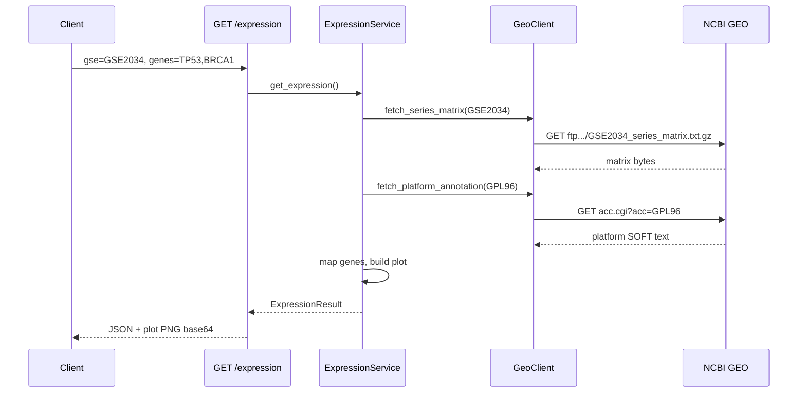

# Run book — GEO Expression Service

Пошаговая инструкция: как установить, запустить сервис и выполнить запрос к NCBI GEO.

## Оглавление

- [Быстрый старт (уже есть репозиторий)](#quick-start)
- [Makefile (кратко)](#makefile)
- [Что это за приложение](#about)
- [Требования](#requirements)
- [1. Переход в каталог проекта](#step-01-clone)
- [2. Виртуальное окружение](#step-02-venv)
  - [Пересоздание .venv](#step-02-venv-recreate)
- [3. Установка зависимостей](#step-03-install)
- [4. Запуск сервера](#step-04-run)
- [5. Проверка health (без NCBI)](#step-06-health)
- [6. Запрос к NCBI: GET /expression](#step-07-expression)
  - [Что происходит при запросе](#ncbi-flow)
  - [Параметры](#expression-params)
  - [Примеры запросов](#expression-examples)
  - [Ожидаемые логи сервера](#ncbi-logs)
  - [Пример ответа](#expression-response)
  - [Сохранить график / декодировать base64](#save-plot)
- [7. Чат: POST /chat](#step-08-chat)
  - [Stub и LLM режимы](#chat-modes)
  - [Тело запроса](#chat-body)
  - [Примеры запросов](#chat-examples)
  - [Пример ответа](#chat-response)
  - [Clarification (без tool)](#chat-clarification)
- [8. Swagger UI](#step-05-swagger)
- [9. Примеры ошибок](#step-08-errors)
- [10. Переменные окружения](#step-09-env)
- [11. Тесты (опционально)](#step-10-tests)
- [12. Типичные проблемы](#step-11-troubleshooting)
- [13. Структура репозитория](#step-12-structure)
- [14. Чеклист](#step-13-checklist)
- [Полезные ссылки](#links)

> Ссылки работают в **Markdown Preview** (`Ctrl+Shift+V`).

---

<a id="quick-start"></a>

## Быстрый старт (уже есть репозиторий)

Все команды ниже выполняются из **корня git-репозитория** (`ncbi-viewer/`).

**WSL + fish** (рекомендуется, если работаете через `/mnt/c/...`):

```fish
cd /mnt/c/Users/user/projects/Quantori/ncbi_geo_app/ncbi-viewer
python3 --version          # нужен 3.11+
python3 -m venv .venv
source .venv/bin/activate.fish
pip install -e .
python -m uvicorn geo_expression_service.main:app --host 127.0.0.1 --port 8000
```

В **другом** терминале — проверка и запрос к NCBI:

```fish
curl -s http://127.0.0.1:8000/health
curl -s --max-time 300 "http://127.0.0.1:8000/expression?gse=GSE2034&genes=TP53,BRCA1"
curl -s --max-time 300 -X POST http://127.0.0.1:8000/chat \
  -H "Content-Type: application/json" \
  -d '{"message": "Show me TP53 and BRCA1 expression in GSE2034"}'
```

Первый запрос `/expression` или `/chat` с новой парой `(gse, genes)` скачивает ~14 MB matrix + ~46 MB аннотацию платформы с NCBI — **30–120 секунд** это нормально.

**PowerShell (Windows, без WSL):**

```powershell
cd C:\Users\user\projects\Quantori\ncbi_geo_app\ncbi-viewer
python -m venv .venv
.\.venv\Scripts\Activate.ps1
pip install -e .
python -m uvicorn geo_expression_service.main:app --host 127.0.0.1 --port 8000
```

> Используйте `python -m uvicorn`, если команда `uvicorn` не найдена — так надёжнее сразу после `pip install -e .`.

<a id="makefile"></a>

## Makefile (кратко)

Из **корня репозитория** (`ncbi-viewer/`). Требуется GNU Make (в WSL: `make --version`).

```bash
cd /mnt/c/Users/user/projects/Quantori/ncbi_geo_app/ncbi-viewer
make help          # все команды
make install       # .venv + pip install -e .
make run           # uvicorn на :8000
make run-dev       # uvicorn с --reload
make lint          # ruff check
make format        # ruff format
make fix           # ruff check --fix + format
make test          # pytest -v (нужен install-dev)
make check         # lint + test
make health        # curl /health (сервер уже запущен)
make plot          # сохранить expression_plot.png (сервер запущен)
```

Параметры через переменные:

```bash
make run PORT=8001
make plot GSE=GSE2034 GENES=TP53,BRCA1 PLOT_OUT=my_plot.png
```

| Target | Что делает |
|--------|------------|
| `install` | создаёт `.venv`, если нет; ставит зависимости (повторно — только при изменении `pyproject.toml`) |
| `install-dev` | то же + pytest + ruff + httpx2 |
| `lint` | `ruff check` |
| `format` | `ruff format` |
| `fix` | `ruff check --fix` + `ruff format` |
| `clean-venv` | удалить `.venv` |
| `check` | `lint` + `test` |

> Если `make venv` падает с `ensurepip is not available` — см. [типичные проблемы](#step-11-troubleshooting) и [пересоздание .venv](#step-02-venv-recreate).

---

<a id="about"></a>

## Что это за приложение

**GEO Expression Service** — FastAPI-бэкенд в папке `geo_expression_service/`. Он:

1. Скачивает матрицу экспрессии из [NCBI GEO](https://www.ncbi.nlm.nih.gov/geo/) по идентификатору серии (GSE).
2. Скачивает аннотацию платформы (GPL) и сопоставляет пробы с символами генов.
3. Строит boxplot по выбранным генам и возвращает PNG в base64.
4. Через `POST /chat` принимает запрос на естественном языке, вызывает тот же pipeline экспрессии (ExpressionTool) и возвращает текст + plot.

| Метод | Путь | NCBI |
|-------|------|------|
| `GET` | `/health` | нет |
| `GET` | `/expression` | **да** — FTP matrix + HTTP platform annotation |
| `POST` | `/chat` | **да**, если распознаны GSE и 2–5 генов (тот же `ExpressionService`) |

---

<a id="requirements"></a>

## Требования

- **Python 3.11+** (`python3 --version` в WSL, `python --version` в Windows)
- **Интернет** — `/expression` и `/chat` (при успешном tool call) обращаются к `ftp.ncbi.nlm.nih.gov` и `www.ncbi.nlm.nih.gov`
- **Windows / WSL / macOS / Linux**

---

<a id="step-01-clone"></a>

## 1. Переход в каталог проекта

### Уже склонирован локально

**WSL / bash / fish:**

```bash
cd /mnt/c/Users/user/projects/Quantori/ncbi_geo_app/ncbi-viewer
```

**PowerShell:**

```powershell
cd C:\Users\user\projects\Quantori\ncbi_geo_app\ncbi-viewer
```

### Клонирование с нуля

```bash
git clone <repo-url> ncbi-viewer
cd ncbi-viewer
```

Дальнейшие шаги (venv, install, run) — **из корня репозитория** (`ncbi-viewer/`).

---

<a id="step-02-venv"></a>

## 2. Виртуальное окружение

> **Важно:** создавайте `.venv` только в **корне репозитория** (`ncbi-viewer/`, рядом с `pyproject.toml`), а **не** в `geo_expression_service/`.
>
> Если вы сейчас в подкаталоге пакета:
>
> ```fish
> cd /mnt/c/Users/user/projects/Quantori/ncbi_geo_app/ncbi-viewer   # fish / WSL
> # или: cd ..   # если уже в geo_expression_service/
> ```

**WSL — bash:**

```bash
python3 -m venv .venv
source .venv/bin/activate
```

**WSL — fish:**

```fish
python3 -m venv .venv
source .venv/bin/activate.fish
```

**PowerShell (Windows):**

```powershell
python -m venv .venv
.\.venv\Scripts\Activate.ps1
```

После активации в prompt появится `(.venv)`.

> **WSL + fish, проект на `/mnt/c/...`:** если `python3 -m venv` падает с `ensurepip is not available`, создайте venv через **Windows Python** из PowerShell (см. [пересоздание .venv](#step-02-venv-recreate)), а в fish активируйте так:
>
> ```fish
> source .venv/Scripts/activate.fish   # не .venv/bin/activate.fish
> ```

<a id="step-02-venv-recreate"></a>

### Пересоздание .venv

Если окружение сломано или создано не в том каталоге:

**WSL — fish:**

```fish
cd /mnt/c/Users/user/projects/Quantori/ncbi_geo_app/ncbi-viewer
deactivate 2>/dev/null; or true
rm -rf .venv
python3 -m venv .venv
source .venv/bin/activate.fish
pip install -e .
```

**WSL — bash:**

```bash
cd /mnt/c/Users/user/projects/Quantori/ncbi_geo_app/ncbi-viewer
deactivate 2>/dev/null || true
rm -rf .venv
python3 -m venv .venv
source .venv/bin/activate
pip install -e .
```

**PowerShell (Windows):**

```powershell
cd C:\Users\user\projects\Quantori\ncbi_geo_app\ncbi-viewer
deactivate
Remove-Item -Recurse -Force .venv -ErrorAction SilentlyContinue
python -m venv .venv
.\.venv\Scripts\Activate.ps1
pip install -e .
```

---

<a id="step-03-install"></a>

## 3. Установка зависимостей

```bash
pip install -e .
```

С dev-зависимостями (pytest):

```bash
pip install -e ".[dev]"
```

Проверка:

```bash
python -c "import geo_expression_service; print('OK')"
python -m uvicorn --version
```

---

<a id="step-04-run"></a>

## 4. Запуск сервера

**Обычный запуск:**

```bash
python -m uvicorn geo_expression_service.main:app --host 127.0.0.1 --port 8000
```

**С автоперезагрузкой при изменении кода:**

```bash
python -m uvicorn geo_expression_service.main:app --host 127.0.0.1 --port 8000 --reload
```

Успешный старт:

```
INFO:     Uvicorn running on http://127.0.0.1:8000 (Press CTRL+C to quit)
INFO:     Application startup complete.
```

Остановка: `Ctrl+C` в терминале с сервером.

Если порт занят — другой порт или завершите старый процесс (см. [типичные проблемы](#step-11-troubleshooting)).

---

<a id="step-06-health"></a>

## 5. Проверка health (без NCBI)

Убедитесь, что сервер жив **до** долгого запроса к GEO.

**Браузер:** [http://127.0.0.1:8000/health](http://127.0.0.1:8000/health)

**curl (WSL / bash / fish):**

```bash
curl -s http://127.0.0.1:8000/health
```

**PowerShell:**

```powershell
Invoke-RestMethod -Uri "http://127.0.0.1:8000/health" | ConvertTo-Json
```

Ожидаемый ответ:

```json
{
  "status": "ok",
  "service": "geo-expression-service"
}
```

---

<a id="step-07-expression"></a>

## 6. Запрос к NCBI: GET /expression

<a id="ncbi-flow"></a>

### Что происходит при запросе



Два HTTP-запроса к NCBI выполняет `GeoClient` (`geo_expression_service/adapters/geo_client.py`):

| Шаг | URL |
|-----|-----|
| Series matrix | `https://ftp.ncbi.nlm.nih.gov/geo/series/GSE{n}nnn/GSE.../matrix/GSE..._series_matrix.txt.gz` |
| Platform GPL | `https://www.ncbi.nlm.nih.gov/geo/query/acc.cgi?acc=GPL...&form=text&view=full` |

<a id="expression-params"></a>

### Параметры

| Параметр | Обязательный | Формат | Пример |
|----------|--------------|--------|--------|
| `gse` | да | `GSE` + цифры | `GSE2034` |
| `genes` | да | 2–5 уникальных символов через запятую | `TP53,BRCA1` |

- GSE и гены приводятся к верхнему регистру.
- Меньше 2 или больше 5 генов → HTTP **422**.

<a id="expression-examples"></a>

### Примеры запросов

**curl (WSL) — рекомендуется `--max-time 300`:**

```bash
curl -s --max-time 300 \
  "http://127.0.0.1:8000/expression?gse=GSE2034&genes=TP53,BRCA1"
```

Краткий вывод только ключевых полей (если установлен `jq`):

```bash
curl -s --max-time 300 \
  "http://127.0.0.1:8000/expression?gse=GSE2034&genes=TP53,BRCA1" \
  | jq '{gse_id, genes, cached, duration_ms, gpl: .mapping.gpl_id}'
```

**PowerShell:**

```powershell
$uri = "http://127.0.0.1:8000/expression?gse=GSE2034&genes=TP53,BRCA1"
$result = Invoke-RestMethod -Uri $uri -TimeoutSec 300
$result | Select-Object gse_id, genes, cached, duration_ms
$result.mapping | ConvertTo-Json -Depth 5
```

**Браузер** (только JSON, без декодирования графика):

```
http://127.0.0.1:8000/expression?gse=GSE2034&genes=TP53,BRCA1
```

<a id="ncbi-logs"></a>

### Ожидаемые логи сервера

При успешном cold-path запросе в терминале с uvicorn появятся строки вида:

```
INFO geo_expression_service.adapters.geo_client GEO download finished: resource=series matrix GSE2034 bytes=...
INFO geo_expression_service.adapters.geo_client Series matrix parsed: gse_id=GSE2034 gpl_id=GPL96 probes=... samples=...
INFO geo_expression_service.adapters.geo_client GEO download finished: resource=platform GPL96 bytes=...
INFO geo_expression_service.domain.annotation_mapper Gene mapping finished: genes=2 mapped_probes=... ...
INFO geo_expression_service.services.expression_service Expression finished: cached=false duration_ms=... gse_id=GSE2034 genes=2
```

Если этих строк нет — запрос не дошёл до NCBI (ошибка валидации, таймаут клиента или сервер не запущен).

<a id="expression-response"></a>

### Пример успешного ответа (сокращённо)

```json
{
  "gse_id": "GSE2034",
  "genes": ["TP53", "BRCA1"],
  "plot": {
    "format": "png_base64",
    "content": "iVBORw0KGgoAAAANSUhEUgAA..."
  },
  "mapping": {
    "gpl_id": "GPL96",
    "unmapped_probe_count": 1234,
    "per_gene": [
      {
        "gene_symbol": "TP53",
        "probes_mapped": 2,
        "aggregation": "mean_log2",
        "skip_reason": null
      }
    ]
  },
  "cached": false,
  "duration_ms": 45230.5
}
```

| Поле | Смысл |
|------|-------|
| `plot.content` | PNG в base64 |
| `mapping.gpl_id` | Платформа, скачанная с NCBI |
| `cached` | `false` на cold path; `true` при повторном запросе с тем же `(gse, genes)` |
| `duration_ms` | Время запроса, включая загрузку с NCBI |

<a id="save-plot"></a>

### Сохранить график / декодировать base64

Поле `plot.content` (в `/expression`) или `expression.plot.content` (в `/chat`) — это **PNG без префикса** `data:image/png;base64,`.

**Онлайн (вставить base64 и скачать PNG):** [Base64 Guru — Decode image](https://base64.guru/converter/decode/image)

**PowerShell** (`/expression`):

```powershell
$response = Invoke-RestMethod -Uri "http://127.0.0.1:8000/expression?gse=GSE2034&genes=TP53,BRCA1" -TimeoutSec 300
[IO.File]::WriteAllBytes("expression_plot.png", [Convert]::FromBase64String($response.plot.content))
Write-Host "Сохранено: expression_plot.png"
```

**PowerShell** (`/chat`):

```powershell
$body = @{ message = "Show me TP53 and BRCA1 expression in GSE2034" } | ConvertTo-Json
$response = Invoke-RestMethod -Uri "http://127.0.0.1:8000/chat" -Method POST `
  -ContentType "application/json" -Body $body -TimeoutSec 300
[IO.File]::WriteAllBytes("chat_plot.png", [Convert]::FromBase64String($response.expression.plot.content))
Write-Host "Сохранено: chat_plot.png, tool_invoked=$($response.tool_invoked)"
```

**Python:**

```python
import base64
import json
import urllib.request

url = "http://127.0.0.1:8000/expression?gse=GSE2034&genes=TP53,BRCA1"
with urllib.request.urlopen(url, timeout=300) as resp:
    data = json.load(resp)

with open("expression_plot.png", "wb") as f:
    f.write(base64.b64decode(data["plot"]["content"]))

print(f"Готово: {data['gse_id']}, duration_ms={data['duration_ms']}")
```

---

<a id="step-08-chat"></a>

## 7. Чат: POST /chat

Естественный язык → тот же `ExpressionService`, что и `GET /expression`. Ответ: текст ассистента + вложенный `expression` с plot и mapping stats.

<a id="chat-modes"></a>

### Stub и LLM режимы

| Режим | Когда | LLM | Tool (GEO) |
|-------|--------|-----|------------|
| **Stub** (по умолчанию) | нет `OPENAI_API_KEY` или `GEO_STUB_LLM=true` | нет — шаблонный текст | **да** — реальный `ExpressionService` |
| **LLM** | задан `OPENAI_API_KEY` и `GEO_STUB_LLM` не true | OpenAI через pydantic-ai (`GEO_OPENAI_MODEL`, default `gpt-4o-mini`) | **да** — tool `get_gene_expression` |

Stub достаточен для оценки: tool вызывается, plot возвращается, в логах есть `ExpressionTool invoked`.

<a id="chat-body"></a>

### Тело запроса

| Поле | Тип | Обязательный | Пример |
|------|-----|--------------|--------|
| `message` | `string` | да | `"Show me TP53 and BRCA1 expression in GSE2034"` |

В сообщении должны быть:
- accession серии: `GSE` + цифры (регистр не важен);
- **2–5** символов генов (парсер извлекает токены вроде `TP53`, `BRCA1`).

<a id="chat-examples"></a>

### Примеры запросов

**Happy path — curl (WSL):**

```bash
curl -s --max-time 300 -X POST http://127.0.0.1:8000/chat \
  -H "Content-Type: application/json" \
  -d '{"message": "Show me TP53 and BRCA1 expression in GSE2034"}'
```

**Три гена:**

```bash
curl -s --max-time 300 -X POST http://127.0.0.1:8000/chat \
  -H "Content-Type: application/json" \
  -d '{"message": "Plot TP53, BRCA1, EGFR in GSE2034"}'
```

**Повторный запрос — проверка кэша** (второй раз `expression.cached` должен стать `true`):

```bash
curl -s --max-time 300 -X POST http://127.0.0.1:8000/chat \
  -H "Content-Type: application/json" \
  -d '{"message": "TP53 and BRCA1 in GSE2034"}'
```

**PowerShell:**

```powershell
$body = '{"message": "Show me TP53 and BRCA1 expression in GSE2034"}'
Invoke-RestMethod -Uri "http://127.0.0.1:8000/chat" -Method POST `
  -ContentType "application/json" -Body $body -TimeoutSec 300 |
  Select-Object tool_invoked, message, @{n='cached';e={$_.expression.cached}}, @{n='duration_ms';e={$_.expression.duration_ms}}
```

<a id="chat-response"></a>

### Пример успешного ответа (сокращённо)

```json
{
  "message": "Here is expression for TP53, BRCA1 in GSE2034 (platform GPL96)...",
  "expression": {
    "gse_id": "GSE2034",
    "genes": ["TP53", "BRCA1"],
    "plot": {
      "format": "png_base64",
      "content": "iVBORw0KGgoAAAANSUhEUgAA..."
    },
    "mapping": {
      "gpl_id": "GPL96",
      "per_gene": [
        {"gene_symbol": "TP53", "probes_mapped": 2, "aggregation": "mean_log2", "skip_reason": null}
      ],
      "unmapped_probe_count": 1234
    },
    "cached": false,
    "duration_ms": 45230.5
  },
  "tool_invoked": true
}
```

| Поле | Смысл |
|------|-------|
| `message` | Текст ассистента (шаблон в stub или ответ LLM) |
| `expression` | Тот же DTO, что у `GET /expression`; `null`, если tool не вызывался |
| `tool_invoked` | `true` — ExpressionTool реально вызван (критично для acceptance) |
| `expression.plot.content` | PNG base64 → [декодировать в картинку](https://base64.guru/converter/decode/image) |

### Ожидаемые логи (happy path)

```
INFO geo_expression_service.services.chat_agent ExpressionTool invoked: gse_id=GSE2034 genes=['TP53', 'BRCA1'] request_id=...
INFO geo_expression_service.services.expression_service Expression finished: cached=false duration_ms=... gse_id=GSE2034 genes=2 request_id=...
INFO geo_expression_service.api.routes.chat Chat route finished: tool_invoked=True gse_id=GSE2034 genes=2 cached=False ...
```

<a id="chat-clarification"></a>

### Clarification (без tool)

Если GSE или гены не распознаны — HTTP **200**, `tool_invoked: false`, `expression: null`, текст с подсказкой.

```bash
curl -s -X POST http://127.0.0.1:8000/chat \
  -H "Content-Type: application/json" \
  -d '{"message": "Hello, what can you do?"}'
```

```bash
curl -s -X POST http://127.0.0.1:8000/chat \
  -H "Content-Type: application/json" \
  -d '{"message": "Show TP53 in GSE2034"}'
```

Второй пример — только один ген (нужно 2–5).

---

<a id="step-05-swagger"></a>

## 8. Swagger UI

| URL | Описание |
|-----|----------|
| [http://127.0.0.1:8000/docs](http://127.0.0.1:8000/docs) | Swagger UI |
| [http://127.0.0.1:8000/redoc](http://127.0.0.1:8000/redoc) | ReDoc |

<a id="swagger-howto"></a>

### Запрос к NCBI через Swagger

1. Откройте `/docs`.
2. `GET /health` → **Try it out** → **Execute** (быстро).
3. `GET /expression` → **Try it out**.
4. Параметры: `gse=GSE2034`, `genes=TP53,BRCA1`.
5. **Execute** — подождите до 2 минут; в терминале сервера должны появиться логи `GEO download finished`.

### Запрос через чат (Swagger)

1. `POST /chat` → **Try it out**.
2. Request body:

```json
{
  "message": "Show me TP53 and BRCA1 expression in GSE2034"
}
```

3. **Execute** — проверьте `tool_invoked: true` и наличие `expression.plot.content`.
4. Base64 из ответа можно вставить на [Base64 Guru — Decode image](https://base64.guru/converter/decode/image).

---

<a id="step-08-errors"></a>

## 9. Примеры ошибок

**Неверный GSE** → HTTP 422, `"error": "invalid_gse_format"`.

**Один ген** → HTTP 422, `"error": "invalid_gene_count"`.

**NCBI недоступен / таймаут** → HTTP 502, `"error": "geo_download_error"`.

**Ошибка разбора аннотации** → HTTP 502, `"error": "mapping_error"`.

**Чат: нераспознанное сообщение** → HTTP **200**, `tool_invoked: false`, `expression: null` (не ошибка — clarification).

**Чат: невалидные гены в tool** (например 1 ген через LLM) → HTTP 422, как у `/expression`.

---

<a id="step-09-env"></a>

## 10. Переменные окружения

Файл `.env` создаётся в **корне репозитория** (рядом с `pyproject.toml`).

| Переменная | По умолчанию | Описание |
|------------|--------------|----------|
| `GEO_HTTP_TIMEOUT_S` | `120` | Таймаут HTTP к NCBI (секунды) |
| `GEO_CACHE_DIR` | `.cache/geo_expression` | Каталог двухуровневого кэша |
| `GEO_CACHE_MAX_ENTRIES` | `256` | Лимит записей кэша |
| `GEO_CACHE_MAX_BYTES` | `536870912` | Лимит размера кэша (512 MB) |
| `GEO_CONCURRENCY_LIMIT` | `4` | Параллельные загрузки (BL-04) |
| `GEO_STUB_LLM` | `false` | `true` — stub-режим чата без OpenAI |
| `OPENAI_API_KEY` | — | Ключ OpenAI; без него — stub |
| `GEO_OPENAI_MODEL` | `gpt-4o-mini` | Модель для LLM-режима чата |

Пример `.env` для медленной сети и stub-чата:

```env
GEO_HTTP_TIMEOUT_S=180
GEO_STUB_LLM=true
```

Пример `.env` с LLM (платный OpenAI API):

```env
OPENAI_API_KEY=sk-...
GEO_OPENAI_MODEL=gpt-4o-mini
```

---

<a id="step-10-tests"></a>

## 11. Тесты

Из корня репозитория:

```bash
make test
```

Или вручную:

```bash
pip install -e ".[dev]"
pytest -v
```

Покрытие (без live-запросов к NCBI):

| Файл | Что проверяет |
|------|----------------|
| `tests/test_validation.py` | GSE/гены, границы 2–5 |
| `tests/test_annotation_mapper.py` | multi-gene `///`, sentinel-значения, `skip_reason` |
| `tests/test_plot_builder.py` | PNG base64 |
| `tests/test_expression_route.py` | HTTP 422 до GEO fetch |
| `tests/test_expression_service.py` | orchestration с mock GeoClient |
| `tests/test_cache_store.py` | LRU, disk tier, negative cache |
| `tests/test_chat_route.py` | парсер чата, stub happy path, clarification |
| `tests/test_health_route.py` | `GET /health` |

---

<a id="step-11-troubleshooting"></a>

## 12. Типичные проблемы

| Симптом | Решение |
|---------|---------|
| `Command 'uvicorn' not found` | `pip install -e .` затем `python -m uvicorn ...` |
| `Command 'python' not found` (WSL) | Используйте `python3` |
| `ModuleNotFoundError: geo_expression_service` | `cd ncbi-viewer`, затем `pip install -e .` (не из `geo_expression_service/`) |
| `.venv` создан в `geo_expression_service/` | Удалите его, пересоздайте в корне — см. [пересоздание .venv](#step-02-venv-recreate) |
| Порт 8000 занят | Другой порт: `--port 8001` или завершите старый uvicorn (см. ниже) |
| curl обрывается на `/expression` или `/chat` | Добавьте `--max-time 300` |
| Долгий ответ 30–120 с | Нормально — идёт загрузка с NCBI |
| `502 geo_download_error` | Интернет, доступность NCBI, увеличьте `GEO_HTTP_TIMEOUT_S` |
| PowerShell: `curl` зависает | `Invoke-RestMethod -TimeoutSec 300` |
| Ошибка активации venv (PowerShell) | `Set-ExecutionPolicy -Scope CurrentUser RemoteSigned` |
| fish: `source .venv/bin/activate` не работает | `source .venv/bin/activate.fish` (Linux venv) или `source .venv/Scripts/activate.fish` (Windows venv на `/mnt/c/`) |
| WSL: `ensurepip is not available` | `sudo apt install python3.12-venv`, либо создайте venv через Windows Python — см. [пересоздание .venv](#step-02-venv-recreate) |

### Завершить зависший uvicorn (Windows)

```powershell
Get-CimInstance Win32_Process -Filter "Name='python.exe'" |
  Where-Object { $_.CommandLine -like '*uvicorn*geo_expression_service*' } |
  ForEach-Object { Stop-Process -Id $_.ProcessId -Force }
```

### Завершить uvicorn (WSL)

```bash
pkill -f "uvicorn geo_expression_service.main:app"
```

---

<a id="step-12-structure"></a>

## 13. Структура репозитория

```
ncbi-viewer/                 ← корень git-репозитория (venv, pip install, uvicorn)
├── Makefile
├── pyproject.toml
├── README.md
├── .local/diagrams/
├── docs/
│   └── run_book.md          ← этот файл
├── geo_expression_service/  ← Python-пакет (код приложения)
│   ├── main.py
│   ├── services/chat_agent.py   ← POST /chat, ExpressionTool
│   └── adapters/geo_client.py   ← запросы к NCBI
├── tests/                   ← unit/API тесты
├── 01-Context/
├── 03-Solution/
└── 04-UI/
```

---

<a id="step-13-checklist"></a>

## 14. Чеклист

- [ ] `python3 --version` (или `python --version`) → 3.11+
- [ ] `cd ncbi-viewer` (корень репозитория)
- [ ] `pip install -e .` без ошибок
- [ ] `python -m uvicorn geo_expression_service.main:app --host 127.0.0.1 --port 8000` стартует
- [ ] `curl -s http://127.0.0.1:8000/health` → `"status":"ok"`
- [ ] `curl -s --max-time 300 ".../expression?gse=GSE2034&genes=TP53,BRCA1"` → JSON с `plot.content`
- [ ] `curl -s --max-time 300 -X POST .../chat -d '{"message":"..."}'` → `tool_invoked: true` и `expression.plot.content`
- [ ] Повторный `/chat` с тем же GSE/генами → `expression.cached: true`
- [ ] В логах сервера есть `GEO download finished` (matrix + platform)
- [ ] PNG из base64 открывается (скрипт выше или [Base64 Guru](https://base64.guru/converter/decode/image))

---

<a id="links"></a>

## Полезные ссылки

- NCBI GEO: https://www.ncbi.nlm.nih.gov/geo/
- GSE2034 (тестовая серия): https://www.ncbi.nlm.nih.gov/geo/query/acc.cgi?acc=GSE2034
- Base64 → PNG (онлайн): https://base64.guru/converter/decode/image
- Архитектура: `03-Solution/03-architecture.md`
- Backlog: `03-Solution/04-backlog.md`
